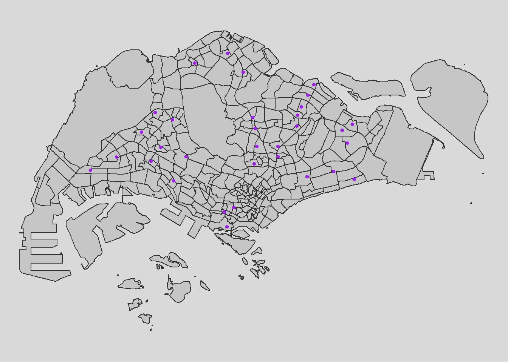
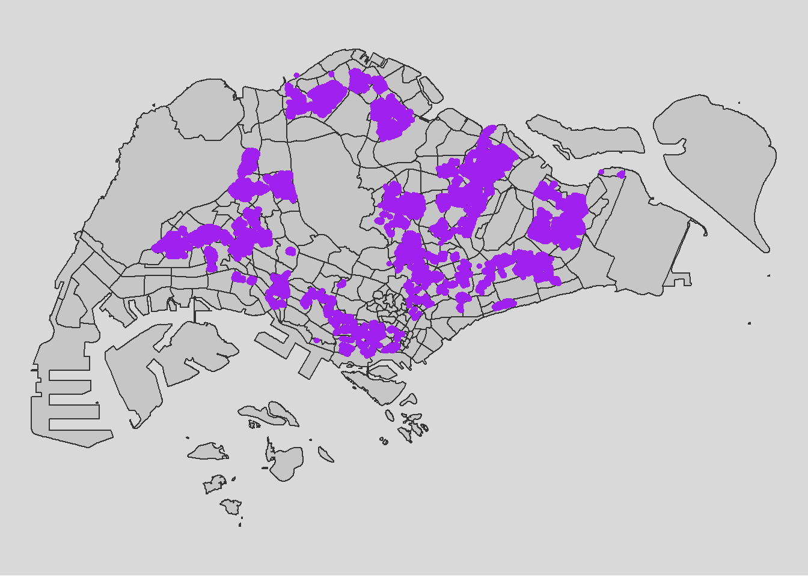
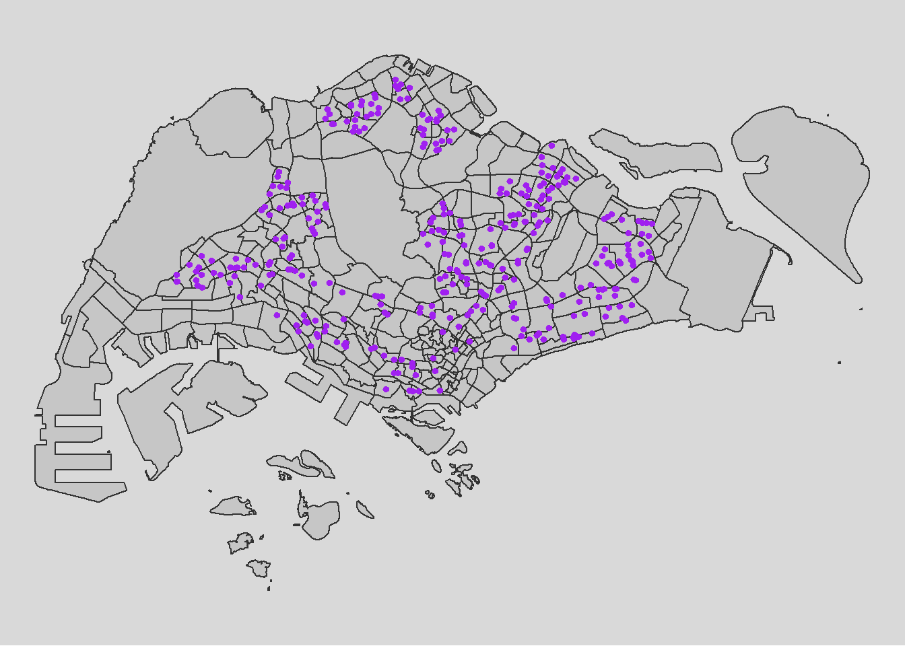
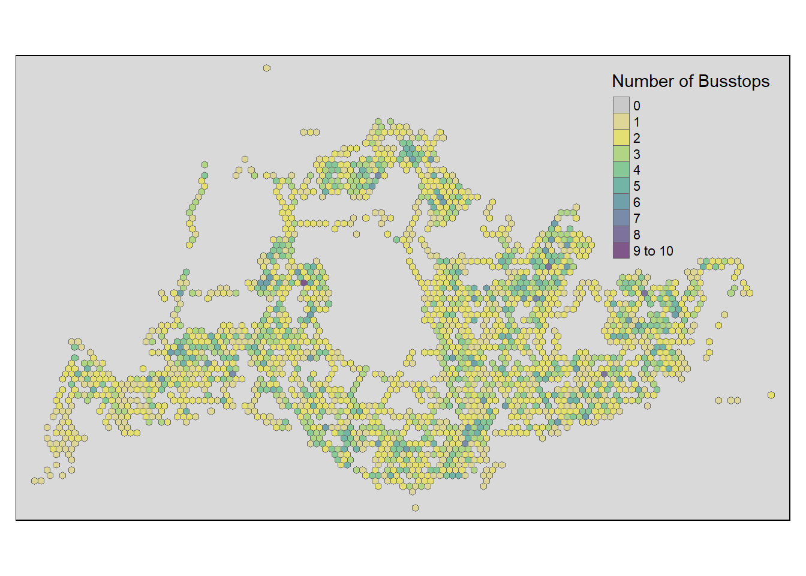
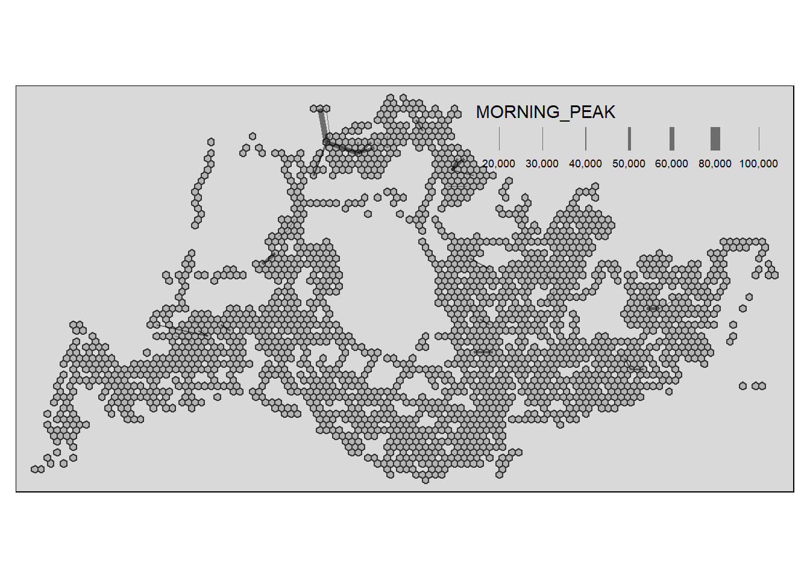
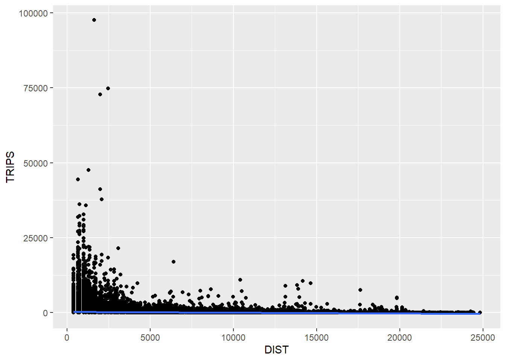
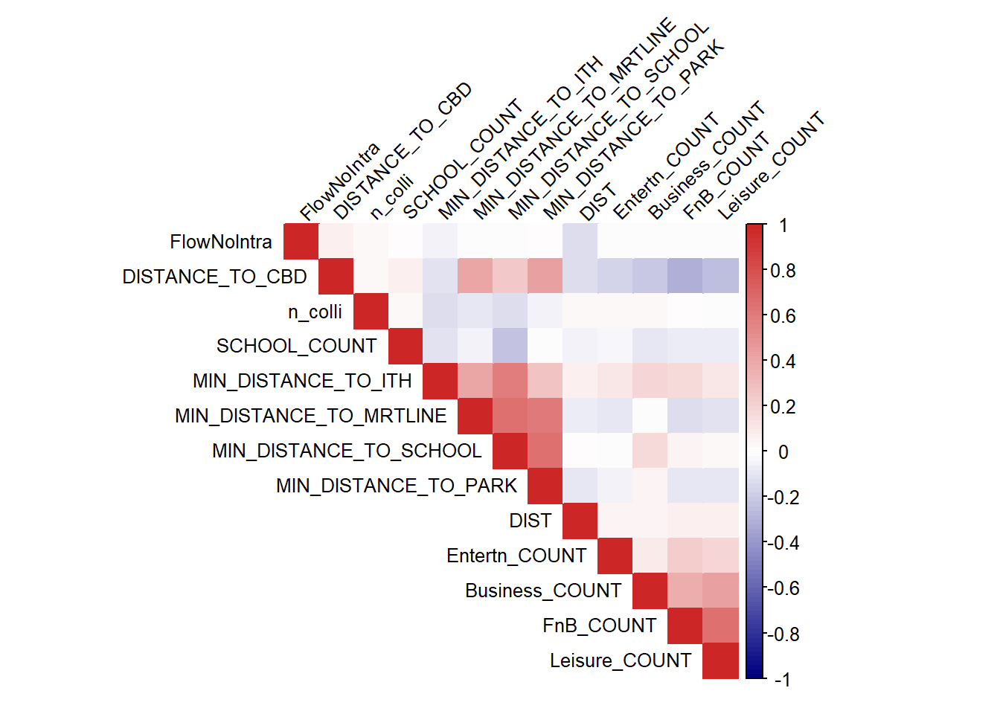

# **Setting the Scene**

What are the driving forces behind urban dwellers to weak up early in morning to commute from their home locations to their work places? What are the impact of removing a public bus service on the commuters reside along the corridor of the bus route? These and many other questions related to urban mobility are challenges faced by transport operators and urban managers.

To provide answer to this question, traditionally, commuters survey will be used. However, commuters survey is a very costly, time-consuming and laborous, not to mention that the survey data tend to take a long time to clean and analyse. As a result, it is not unusual, by the time the survey report was ready, most of the information already out-of-date!

As city-wide urban infrastructures such as public buses, mass rapid transits, public utilities and roads become digital, the data sets obtained can be used as a framework for tracking movement patterns through space and time. This is particularly true with the recent trend of massive deployment of pervasive computing technologies such as GPS on the vehicles and SMART cards used by public transport commuters.

Unfortunately, this explosive growth of geospatially-referenced data has far outpaced the planner's ability to utilize and transform the data into insightful information thus creating an adverse impact on the return on the investment made to collect and manage this data.

# **Motivation and Objective**

This take-home exercise is motivated by two main reasons. Firstly, despite increasing amounts of open data available for public consumption, there has not been significant practice research carried out to show how these disparate data sources can be integrated, analysed, and modelled to support policy making decisions.

Secondly, there is a general lack of practical research to show how geospatial data science and analysis (GDSA) can be used to support decision-making.

Hence, your task for this take-home exercise is to conduct a case study to demonstrate the potential value of GDSA to integrate publicly available data from multiple sources for building a spatial interaction models to determine factors affecting urban mobility patterns of public bus transit.

# **The Data**

## **Open Government Data**

For the purpose of this assignment, data from several open government sources will be used:

-   *Passenger Volume by Origin Destination Bus Stops*, *Bus Stop Location*, *Train Station* and *Train Station Exit Point*, just to name a few of them, from [LTA DataMall](https://datamall.lta.gov.sg/content/datamall/en.html).

-   *Master Plan 2019 Subzone Boundary*, *HDB Property Information*, *School Directory and Information* and other relevant data from [Data.gov.sg](https://beta.data.gov.sg/).

## **Specially collected data**

-   *Business*, *entertn*, *F&B*, *FinServ*, *Leisure&Recreation* and *Retails* are geospatial data sets of the locations of business establishments, entertainments, food and beverage outlets, financial centres, leisure and recreation centres, retail and services stores/outlets I compiled for urban mobility study. They are available on in the geospatial folder to Take-home Exercise 2 data folder.

-   HDB: This data set is the geocoded version of *HDB Property Information* data from data.gov. The data set is prepared using September 2021 data. If you want to prepare you own data by using the latest *HDB Property Information* provided on data.gov.sg, this [link](https://is415-msty.netlify.app/posts/2021-10-25-take-home-exercise-3/?panelset6=glimpse%28%29#geocoding-our-aspatial-data) provides a useful step-by-step guide.

# **The Task**

The specific tasks of this take-home exercise are as follows:

## **Geospatial Data Science**

-   Derive an analytical hexagon data of 375m (this distance is the perpendicular distance between the centre of the hexagon and its edges) to represent the [traffic analysis zone (TAZ)](https://tmg.utoronto.ca/files/Reports/Traffic-Zone-Guidance_March-2021_Final.pdf).

-   With reference to the time intervals provided in the table below, construct an O-D matrix of commuter flows for a time interval of your choice by integrating *Passenger Volume by Origin Destination Bus Stops* and *Bus Stop Location* from [LTA DataMall](https://datamall.lta.gov.sg/content/datamall/en.html). The O-D matrix must be aggregated at the analytics hexagon level

    | Peak hour period             | Bus tap on time |
    |------------------------------|-----------------|
    | Weekday morning peak         | 6am to 9am      |
    | Weekday afternoon peak       | 5pm to 8pm      |
    | Weekend/holiday morning peak | 11am to 2pm     |
    | Weekend/holiday evening peak | 4pm to 7pm      |

-   Display the O-D flows of the passenger trips by using appropriate geovisualisation methods (not more than 5 maps).

-   Describe the spatial patterns revealed by the geovisualisation (not more than 100 words per visual).

-   Assemble at least three propulsive and three attractiveness variables by using aspatial and geospatial from publicly available sources.

-   Compute a distance matrix by using the analytical hexagon data derived earlier.

## **Spatial Interaction Modelling**

-   Calibrate spatial interactive models to determine factors affecting urban commuting flows at the selected time interval.

-   Present the modelling results by using appropriate geovisualisation and graphical visualisation methods. (Not more than 5 visuals)

-   With reference to the Spatial Interaction Model output tables, maps and data visualisation prepared, describe the modelling results. (not more than 100 words per visual).

# Install R Package

These are packages here necessary for this project:

-   sf: Handles geospatial data using the Simple Features format.

-   sp: Core package for spatial data structures and operations.

-   sfdep: Provides spatial econometrics tools, including spatial weights matrices.

-   tidyverse: Collection of packages for tidy data manipulation and visualization.

-   tmap: Creates thematic maps for effective visualization.

-   viridis: Offers perceptually uniform color palettes.

-   reshape2: Reshapes and aggregates data for better compatibility with plotting functions.

-   performance: Evaluates the performance of algorithms or functions.

-   stplanr: Provides spatial transport planning functions.

-   httr: Makes HTTP requests, useful for API interactions.

-   lwgeom: Extends sf functionality with additional geometric operations.


::: {.cell}

```{.r .cell-code}
pacman::p_load(sf, sp, sfdep, tidyverse, tmap, viridis, reshape2, performance,  stplanr, httr, lwgeom, DT, units)
```
:::


# 1. Importing Data

We will import the data as a first step before proceeding with data cleaning, data wrangling and data exploration for the following:

-   **Passenger Volume**, a csv file, data set downloaded from [LTA DataMall](https://datamall.lta.gov.sg/content/datamall/en.html)

-   **MPSZ-2019**, a MULTIPOLYGON feature layer ESRI shapefile format providing the sub-zone boundary of URA Master Plan 2019

-   **BusStop**, a POINT feature layer ESRI shapefile format

-   **Train Station**, a POLYGON feature layer ESRI shapefile format

-   **Train Station Exit Point**, a POLYGON feature layer ESRI shapefile format

-   **Train Lines**, LINESTRING feature layer in KML format

-   **Central Business District**, google-sourced location

-   **Intergrated Transoort Hub**, a POINT feature layer in KML format

-   **Parks**, a POINT feature layer in KML format

-   **HDB**, a csv file, data set downloaded and prepared by Prof Kam and his students

-   **School**, a csv file downloaded from LTA MALL

-   **Specially Collected Data**, other vital data collected with POLYGON feature layer in ESRI shapefile format

::: panel-tabset
## Passenger Volume

**Passenger Volume** is an aspatial data, we can import the data simply by using the read_csv function from tidyverse package and output it as a tibble dataframe called `odbus`


::: {.cell}

```{.r .cell-code}
odbus <- read_csv("data/aspatial/origin_destination_bus_202310.csv")
```
:::


## MPSZ-2019

**MPSZ-2019**: This data provides the sub-zone boundary of URA Master Plan 2019. Both data sets are in ESRI shapefile format. We save it as a sf data frame called `mpsz` using the **st_read** function of the sf package. The data is then geo-referenced to coordinates from the Singapore SVY21 coordinate system (EPSG: 3414).

> Note that the geometry data provided in the datasets needs to be projected to local standards and should be same for all datasets. Therefore we will be have to make sure or transform all the datasets to projected CRS using Singapore SVY21 coordinate system as mentioned above.)


::: {.cell}

```{.r .cell-code}
mpsz <- st_read(dsn =  "data/geospatial", layer = "MPSZ-2019") %>% 
  st_transform(crs = 3414)
```
:::


Note st_read() function of sf package is used to import the shapefile into R as sf data frame. st_transform() function of sf package is used to transform the projection to crs 3414.


::: {.cell}

```{.r .cell-code}
mpsz <- st_make_valid(mpsz)
length(which(st_is_valid(mpsz) == FALSE))


write_rds(mpsz, "data/rds/mpsz.rds")
```
:::

::: {.cell}

```{.r .cell-code}
mpsz <- read_rds( "data/rds/mpsz.rds")
```
:::


## Bus Stop Location

**Bus Stop** is a geospatial data in .shp file. We save it as a sf data frame called `busstop` using the **st_read** function of the sf package. The data is then geo-referenced to coordinates from the Singapore SVY21 coordinate system (EPSG: 3414)


::: {.cell}

```{.r .cell-code}
busstop <- st_read(dsn = "data/geospatial", 
                   layer = "BusStop") %>%
  st_transform(crs=3414)
```
:::


## CBD

Proximity to CBD is often a popular variable for a very good reason - nearer means more dense population. Even though the Singapore goverment is planning to mitigate this by constructing hubs in each town, it is unlikely that proximity to city does not affect travel decisions. Coordinates of CBD is dervied from [GeoHack](https://geohack.toolforge.org/geohack.php?pagename=Central_Area,_Singapore&params=1_17_30_N_103_51_00_E_type:city(60520)_region:SG)


::: {.cell}

```{.r .cell-code}
lat <- 1.291667
lng <- 103.85

cbd_sf <- data.frame(lat, lng) %>%
  st_as_sf(coords = c("lng", "lat"), crs=4326) %>%
  st_transform(crs=3414)
```
:::


## Train Station

**Train Station** is a geospatial data in .shp file. We save it as a sf data frame called `trainstation` using the **st_read** function of the sf package. The data is then geo-referenced to coordinates from the Singapore SVY21 coordinate system (EPSG: 3414)


::: {.cell}

```{.r .cell-code}
trainstation <- st_read(dsn = "data/geospatial", 
                   layer = "RapidTransitSystemStation") %>%
  st_transform(crs=3414)
```
:::


## Train Station Exit Point

**Train Station Exit Point** is a geospatial data in .shp file. We save it as a sf data frame called `trainstationEP` using the **st_read** function of the sf package. The data is then geo-referenced to coordinates from the Singapore SVY21 coordinate system (EPSG: 3414)


::: {.cell}

```{.r .cell-code}
trainstationEP <- st_read(dsn = "data/geospatial", 
                   layer = "RapidTransitSystemStation") %>%
  st_transform(crs=3414)

write_rds(trainstationEP, "data/rds/trainstationEP.rds")
```
:::


## Train Lines

Due to the issue with geometry in the trainstation dataset, it is unlikely we will be able to make good use of it. One other possible substitute could be the train line dataset from data.gov.sg. With it, we can calculate proximity to train lines.


::: {.cell}

```{.r .cell-code}
mrt = st_read("data/geospatial/MasterPlan2003MRTLine.kml")
```
:::

::: {.cell}

```{.r .cell-code}
mrt <- st_zm(mrt)
mrt <- st_transform(mrt, crs = 3414)

write_rds(mrt, "data/rds/mrt.rds")
```
:::


Below is a visualisation of how our data looks like, exactly as described for a LINESTRING format, and exactly as expected. We expect to be able to calculate proximity to train lines since the train station datasets seems to be having an issue.


::: {.cell}

```{.r .cell-code}
mrt <- read_rds( "data/rds/mrt.rds")

tmap_mode("plot")

tm_shape(mpsz)+
  tm_polygons(alpha = 0.5) +
  tm_borders(lwd = 1, alpha = 0.5) +
  tm_layout(frame = FALSE)+
  tmap_style("gray")+
tm_shape(mrt) +
  tm_lines(col = "purple", size = 0.1) +
  tm_layout(legend.position = c("left", "bottom"))
```

::: {.cell-output-display}
{width=672}
:::
:::


## Intergrated Transoort Hub (ITH)

For a city-state like Singapore, the importance of distance to city for us might not be as big as compared to other countries like China and Singapore. Furthermore, the government already planned for the scenario of traffic congestion by constructing Intergrated Transport Hubs all over Singapore. This is to promote traffic and activities within each SUBZONE instead of overcrowding the central district. Hence, it would be wise to include that in our analysis and be dearly wrong so if we do not.


::: {.cell}

```{.r .cell-code}
ith = st_read("data/geospatial/MasterPlan2019SDCPIntegratedTransportHublayerKML.kml")
```
:::

::: {.cell}

```{.r .cell-code}
ith <- st_zm(ith)
ith <- st_transform(ith, crs = 3414)

write_rds(ith, "data/rds/ith.rds")
```
:::


As expected of ITHs, the locations are spread out across the island and do not cluster


::: {.cell}

```{.r .cell-code}
ith <- read_rds( "data/rds/ith.rds")

tmap_mode("plot")

tm_shape(mpsz)+
  tm_polygons(alpha = 0.5) +
  tm_borders(lwd = 1, alpha = 0.5) +
  tm_layout(frame = FALSE)+
  tmap_style("gray")+
tm_shape(ith) +
  tm_dots(col = "purple", size = 0.1) +
  tm_layout(legend.position = c("left", "bottom"))
```

::: {.cell-output-display}
{width=672}
:::
:::


## Parks


::: {.cell}

```{.r .cell-code}
parks = st_read("data/geospatial/Parks.kml")
```
:::

::: {.cell}

```{.r .cell-code}
parks <- st_zm(parks)
parks <- st_transform(parks, crs = 3414)

write_rds(parks, "data/rds/parks.rds")
```
:::

::: {.cell}

```{.r .cell-code}
parks <- read_rds( "data/rds/parks.rds")

tmap_mode("plot")

tm_shape(mpsz)+
  tm_polygons(alpha = 0.5) +
  tm_borders(lwd = 1, alpha = 0.5) +
  tm_layout(frame = FALSE)+
  tmap_style("gray")+
tm_shape(parks) +
  tm_dots(col = "purple", size = 0.1) +
  tm_layout(legend.position = c("left", "bottom"))
```

::: {.cell-output-display}
{width=672}
:::
:::


## HDB

**HDB**: Using geocoded version of HDB Property Information data from data.gov


::: {.cell}

```{.r .cell-code}
hdb <- read_csv("data/aspatial/hdb.csv")
hdb_sf <- st_as_sf(hdb, coords = c("lng", "lat"), crs = 4326) %>%
  st_transform(crs = 3414)

write_rds(hdb_sf, "data/rds/hdb_sf.rds")
```
:::

::: {.cell}

```{.r .cell-code}
hdb_sf <- read_rds( "data/rds/hdb_sf.rds")

tmap_mode("plot")

tm_shape(mpsz)+
  tm_polygons(alpha = 0.5) +
  tm_borders(lwd = 1, alpha = 0.5) +
  tm_layout(frame = FALSE)+
  tmap_style("gray")+
tm_shape(hdb_sf) +
  tm_dots(col = "purple", size = 0.1) +
  tm_layout(legend.position = c("left", "bottom"))
```

::: {.cell-output-display}
{width=672}
:::
:::


## School Directory

**School Directory**: Using geocoded version of HDB Property Information data from data.gov

The provided code chunks perform geocoding using the SLA [OneMap API](https://www.onemap.gov.sg/apidocs/) in R. The process involves reading input data in CSV format into the R Studio environment using the **`read_csv`** function from the **`readr`** package. The geocoding is then executed using a series of HTTP calls facilitated by functions from the **`httr`** package, sending individual records to the OneMap geocoding server.

The results are organized into two tibble data.frames: **`found`** and **`not_found`**. The **`found`** data.frame contains records that were successfully geocoded, while **`not_found`** includes postal codes that failed the geocoding process.

In the final step, the **`found`** data table is joined with the initial CSV data table using a unique identifier (**`POSTAL`**) shared between the two data tables. The resulting data table is saved as a new CSV file named "found."


::: {.cell}

```{.r .cell-code}
school <- read_csv("data/aspatial/Generalinformationofschools.csv")
```
:::


### Geocoding using SLA API


::: {.cell}

```{.r .cell-code}
url<-"https://www.onemap.gov.sg/api/common/elastic/search"

csv<-read_csv("data/aspatial/Generalinformationofschools.csv")
postcodes<-csv$`postal_code`

found<-data.frame()
not_found<-data.frame()

for(postcode in postcodes){
  query<-list('searchVal'=postcode,'returnGeom'='Y','getAddrDetails'='Y','pageNum'='1')
  res<- GET(url,query=query)
  
  if((content(res)$found)!=0){
    found<-rbind(found,data.frame(content(res))[4:13])
  } else{
    not_found = data.frame(postcode)
  }
}
```
:::


Next, the code chunk below will be used to combine both *found* and *not_found* data.frames into a single tibble data.frame called *merged*. At the same time, we will write *merged* and *not_found* tibble data.frames into two separate csv files called *schools* and *not_found* respectively.


::: {.cell}

```{.r .cell-code}
merged = merge(csv,found, by.x='postal_code', by.y='results.POSTAL',all=TRUE)
               write.csv(merged, file="data/aspatial/schools.csv")
               write.csv(not_found, file="data/aspatial/not_found.csv")
```
:::


### Tidying schools data.frame

In this sub-section, we will import schools.csv into R environment and at the same time tidying the data by selecting only the necessary fields as well as rename some field:

-   import schools.csv in R environment as an tibble data.frame called schools,

-   rename results.LATITUDE and results.LONGITUDE to latitude and longitude respectively,

-   retain only postal_code, school_name, latitude and longitude in schools tibble data.frame

-   With the help of Google Map, we derived the location information of the ungeocoded school by using it's postcode for "ZHENGHUA SECONDARY SCHOOL"


::: {.cell}

```{.r .cell-code}
schools <- read_csv("data/aspatial/schools.csv") %>%
  rename(latitude = "results.LATITUDE",
         longitude = "results.LONGITUDE") %>%
  bind_rows(tibble(
    postal_code = "679962",
    school_name = "ZHENGHUA SECONDARY SCHOOL",
    latitude = 1.3887,
    longitude = 103.7652
  )) %>%
  drop_na() %>%
  select(postal_code, school_name, latitude, longitude)
```
:::


### Converting an aspatial data into sf tibble data.frame

Next, we converted schools tibble data.frame data into a simple feature tibble data.frame called **schools_sf** by using values in latitude and longitude field using **st_as_sf** function.


::: {.cell}

```{.r .cell-code}
schools_sf <- st_as_sf(schools,
                       coords =c("longitude","latitude"),
                       crs=4326) %>%
  st_transform(crs=3414)

write_rds(schools_sf, "data/rds/schools_sf.rds")
```
:::


### Plotting a point simple feature layer of schools onto mpsz


::: {.cell}

```{.r .cell-code}
schools_sf <- read_rds( "data/rds/schools_sf.rds")

tmap_mode("plot")

tm_shape(mpsz)+
  tm_polygons(alpha = 0.5) +
  tm_borders(lwd = 1, alpha = 0.5) +
  tm_layout(frame = FALSE)+
  tmap_style("gray")+
tm_shape(schools_sf) +
  tm_dots(col = "purple", size = 0.1) +
  tm_layout(legend.position = c("left", "bottom"))
```

::: {.cell-output-display}
{width=672}
:::
:::


## Specially Collected Data

Now, let's import the rest of the data


::: {.cell}

```{.r .cell-code}
Business <- st_read(dsn = "data/geospatial", 
                   layer = "Business") %>%
  st_transform(crs=3414)
```

::: {.cell-output .cell-output-stdout}
```
Reading layer `Business' from data source 
  `C:\weipengten\Main\Geospatial_Analytics\Analyzing_Bus_Traffic_Flows\data\geospatial' 
  using driver `ESRI Shapefile'
Simple feature collection with 6550 features and 3 fields
Geometry type: POINT
Dimension:     XY
Bounding box:  xmin: 3669.148 ymin: 25408.41 xmax: 47034.83 ymax: 50148.54
Projected CRS: SVY21 / Singapore TM
```
:::
:::

::: {.cell}

```{.r .cell-code}
FinServ <- st_read(dsn = "data/geospatial", 
                   layer = "FinServ") %>%
  st_transform(crs=3414)
```

::: {.cell-output .cell-output-stdout}
```
Reading layer `FinServ' from data source 
  `C:\weipengten\Main\Geospatial_Analytics\Analyzing_Bus_Traffic_Flows\data\geospatial' 
  using driver `ESRI Shapefile'
Simple feature collection with 3320 features and 3 fields
Geometry type: POINT
Dimension:     XY
Bounding box:  xmin: 4881.527 ymin: 25171.88 xmax: 46526.16 ymax: 49338.02
Projected CRS: SVY21 / Singapore TM
```
:::
:::

::: {.cell}

```{.r .cell-code}
FnB <- st_read(dsn = "data/geospatial", 
                   layer = "F&B") %>%
  st_transform(crs=3414)
```

::: {.cell-output .cell-output-stdout}
```
Reading layer `F&B' from data source 
  `C:\weipengten\Main\Geospatial_Analytics\Analyzing_Bus_Traffic_Flows\data\geospatial' 
  using driver `ESRI Shapefile'
Simple feature collection with 1919 features and 3 fields
Geometry type: POINT
Dimension:     XY
Bounding box:  xmin: 6010.495 ymin: 25343.27 xmax: 45462.43 ymax: 48796.21
Projected CRS: SVY21 / Singapore TM
```
:::
:::

::: {.cell}

```{.r .cell-code}
Retails <- st_read(dsn = "data/geospatial", 
                   layer = "Retails") %>%
  st_transform(crs=3414)
```

::: {.cell-output .cell-output-stdout}
```
Reading layer `Retails' from data source 
  `C:\weipengten\Main\Geospatial_Analytics\Analyzing_Bus_Traffic_Flows\data\geospatial' 
  using driver `ESRI Shapefile'
Simple feature collection with 37635 features and 3 fields
Geometry type: POINT
Dimension:     XY
Bounding box:  xmin: 4737.982 ymin: 25171.88 xmax: 48265.04 ymax: 50135.28
Projected CRS: SVY21 / Singapore TM
```
:::
:::

::: {.cell}

```{.r .cell-code}
Entertn <- st_read(dsn = "data/geospatial", 
                   layer = "entertn") %>%
  st_transform(crs=3414)
```

::: {.cell-output .cell-output-stdout}
```
Reading layer `entertn' from data source 
  `C:\weipengten\Main\Geospatial_Analytics\Analyzing_Bus_Traffic_Flows\data\geospatial' 
  using driver `ESRI Shapefile'
Simple feature collection with 114 features and 3 fields
Geometry type: POINT
Dimension:     XY
Bounding box:  xmin: 10809.34 ymin: 26528.63 xmax: 41600.62 ymax: 46375.77
Projected CRS: SVY21 / Singapore TM
```
:::
:::

::: {.cell}

```{.r .cell-code}
Leisure <- st_read(dsn = "data/geospatial", 
                   layer = "Liesure&Recreation") %>%
  st_transform(crs=3414)
```

::: {.cell-output .cell-output-stdout}
```
Reading layer `Liesure&Recreation' from data source 
  `C:\weipengten\Main\Geospatial_Analytics\Analyzing_Bus_Traffic_Flows\data\geospatial' 
  using driver `ESRI Shapefile'
Simple feature collection with 1217 features and 30 fields
Geometry type: POINT
Dimension:     XY
Bounding box:  xmin: 6010.495 ymin: 25134.28 xmax: 48439.77 ymax: 50078.88
Projected CRS: SVY21 / Singapore TM
```
:::
:::

:::

# 2. Data Cleaning

::: panel-tabset
## Passenger Volume

### Data Exploration


::: {.cell}

```{.r .cell-code}
glimpse(odbus)
```
:::


As we intend to utilize Bus-stop codes as our unique identifiers when joining with our other datasets, it is not advisable to have it remain as a chr datatype. In fact, we should change it to a factor datatype.


::: {.cell}

```{.r .cell-code}
odbus$ORIGIN_PT_CODE <- as.factor(odbus$ORIGIN_PT_CODE)
odbus$DESTINATION_PT_CODE <- as.factor(odbus$DESTINATION_PT_CODE)
```
:::


### Checking for Duplicates

Passed initial checks in code chunk below for whole duplicate rows,


::: {.cell}

```{.r .cell-code}
duplicate <- odbus %>%
  group_by_all() %>%
  filter(n()>1) %>%
  ungroup()
duplicate
```
:::


### Checking for Missing Data

There is no missing data


::: {.cell}

```{.r .cell-code}
summary(odbus)
```
:::


### Classifying Peak Hours

With reference to the time intervals provided in the requirements, we computed the passenger trips generated by origin. The passenger trips by origin are saved as - weekday_morning_peak


::: {.cell}

```{.r .cell-code}
weekday_morning_peak <- odbus %>%
  filter(DAY_TYPE == "WEEKDAY") %>%
  filter(TIME_PER_HOUR >= 6 &
           TIME_PER_HOUR <= 9) %>%
  group_by(ORIGIN_PT_CODE,
           DESTINATION_PT_CODE) %>%

  summarise(TRIPS = sum(TOTAL_TRIPS))


write_rds(weekday_morning_peak, "data/rds/weekday_morning_peak.rds")
```
:::

::: {.cell}

```{.r .cell-code}
weekday_morning_peak <- read_rds("data/rds/weekday_morning_peak.rds")
```
:::


In the code above, we have did a summation of Origin trips , grouped by the origin bus stop number for the weekday_morning_peak through filtering for weekdays for the time range 6am to 9am.

We save our processed data into .rds data format files using the `write_rds()` of **readr** package. The output file is saved in *rds* sub-folder. We do this to reduce the loading time and more importantly, we can avoid uploading the large raw files onto GitHub.

## Bus Stop Location

### Checking for Duplicates

Passed initial checks for whole duplicate rows, however...


::: {.cell}

```{.r .cell-code}
duplicate <- busstop %>%
  group_by_all() %>%
  filter(n()>1) %>%
  ungroup()
duplicate
```
:::


duplicate bus stops found, removing duplicates directly...


::: {.cell}

```{.r .cell-code}
duplicates <- busstop[duplicated(busstop$BUS_STOP_N), ]
# Check if there are any duplicates
if (nrow(duplicates) > 0) {
  cat("Duplicate values found in the BUS_STOP_N column.\n")
  print(duplicates)
  # Remove duplicates from the original dataframe
  busstop <- busstop[!duplicated(busstop$BUS_STOP_N), ]
  cat("Duplicates removed from the BUS_STOP_N column.\n")
} else {
  cat("No duplicate values found in the BUS_STOP_N column.\n")
}
```
:::


Checked duplicates removed successfully


::: {.cell}

```{.r .cell-code}
duplicates <- busstop[duplicated(busstop$BUS_STOP_N), ]
# Check if there are any duplicates
if (nrow(duplicates) > 0) {
  cat("Duplicate values found in the BUS_STOP_N column.\n")
  print(duplicates)
} else {
  cat("No duplicate values found in the BUS_STOP_N column.\n")
}
```
:::


### Checking for Missing Data

No missing data


::: {.cell}

```{.r .cell-code}
summary(busstop)
```
:::


Finally, we will save the cleaned busstop dataset into .rds data format using the `write_rds()` of **readr** package. The output file is saved in *rds* sub-folder. We do this to reduce the loading time and more importantly, we can avoid uploading the large raw files onto GitHub.


::: {.cell}

```{.r .cell-code}
write_rds(busstop, "data/rds/busstop.rds")
```
:::

::: {.cell}

```{.r .cell-code}
busstop <- read_rds("data/rds/busstop.rds")
```
:::


## Hexagonal Dataset

### Create Hexagon Dataset from busstop

Next we proceed to fulfill our requirement of preparing a hexagon dataset with specified cell dimensions of 375 by 375 units called **hexagon** using the **st_make_grid** function from the sf package.

We convert it into a sf dataframe called **hexagon_sf** using the **st_sf** function of sf package.

The code also adds a new variable/column called "grid_id" to the sf object. The "grid_id" values are assigned incrementally, starting from 1 and corresponding to the order of the hexagons in the grid. This step essentially assigns a unique identifier to each hexagon in the grid, facilitating further spatial analysis or mapping.


::: {.cell}

```{.r .cell-code}
hexagon = st_make_grid(busstop, c(375, 375), what = "polygons", square = FALSE)
# To sf and add grid ID
hexagon_sf = st_sf(hexagon) %>%
  # add grid ID
  mutate(grid_id = 1:length(lengths(hexagon))) %>%
  st_transform(crs = 3414)
```
:::


let's change grid_id factor


::: {.cell}

```{.r .cell-code}
hexagon_sf$grid_id <- as.factor(hexagon_sf$grid_id)
```
:::


### Checking for Duplicates


::: {.cell}

```{.r .cell-code}
duplicates <- hexagon_sf[duplicated(hexagon_sf$grid_id), ]
# Check if there are any duplicates
if (nrow(duplicates) > 0) {
  cat("Duplicate values found in the grid_id column.\n")
  print(duplicates)
} else {
  cat("No duplicate values found in the grid_id column.\n")
}
```
:::


### Checking for Missing Data

A brief overplot shows that there are 9918 grids in total and 7744 are without bus stops. We have a max of 10 bus stops per grid_id


::: {.cell}

```{.r .cell-code}
hexagon_sf$n_colli = lengths(st_intersects(hexagon_sf, busstop))

count_all_grid_ids <- n_distinct(hexagon_sf$grid_id)

count_zero_bus_stops <- hexagon_sf %>%

  filter(n_colli == 0) %>%

  summarize(count = n_distinct(grid_id)) %>%

  pull(count)

print(count_all_grid_ids)

print(count_zero_bus_stops)

summary(hexagon_sf$n_colli)
```
:::


Filter for only hexagon data with non-zero counts of bus stops


::: {.cell}

```{.r .cell-code}
hexagon_sf = filter(hexagon_sf, n_colli > 0)
write_rds(hexagon_sf, "data/rds/hexagon_sf.rds")
```
:::

::: {.cell}

```{.r .cell-code}
hexagon_sf <- read_rds("data/rds/hexagon_sf.rds")
```
:::


### VIsualising the dataset

We can also do a visualisation to analyze the distribution of busstops. We specify break points at 0,1,2,3,4 and 5

From the map below, it is obvious that most hexagons have 1 or 2 bus stops in their grid with some having 4 or 5 bus stops. There is approximately one 'cluster' that are close to each other and having 4 or 5 bus stops in each region in North, East, South, West.


::: {.cell}

```{.r .cell-code}
#| code-fold: true

#| code-summary: "Show the code"

tmap_mode("plot")

map_busstopcounts = tm_shape(hexagon_sf) +

  tm_fill(

    col = "n_colli",

    palette = c("grey",rev(viridis(5))),

    breaks = c(0, 1, 2, 3, 4, 5,6,7,8,9,10),

    title = "Number of Busstops",

    id = "grid_id",

    showNA = FALSE,

    alpha = 0.6,

    popup.vars = c(

      "Number of collisions: " = "n_colli"

    ),

    popup.format = list(

      n_colli = list(format = "f", digits = 0)

    )

  ) +

  tm_borders(col = "grey40", lwd = 0.7) +
  tm_view(set.zoom.limits = c(11, 14))

map_busstopcounts
```

::: {.cell-output-display}
{width=672}
:::
:::


A few notable findings were:

-   In the North-West, bus stops are scarce around the cemetery in Choa Chu Kang, the nearest bus stops in that area are those along Lim Chu Kang road. Tengah Airbase is also located in that area.

-   At the far East, bus stops are scarce around Changi Airport

    *- "grid_id" = 9888 is an extreme outlier, we will need to drop it*

    *- "grid_id" for 9182, 9348, 9431 are potential outliers as well*

-   Towards the middle, we have Paya Lebar Airbase

-   In the middle, we have the Central Water Catchment

-   A standalone bus stop in Sentosa Island

    *- "grid_id" = 5105 is a potential outlier and should be considered for exclusion*

-   A few bus stops in Johor are surprisingly in our dataset too and in

    *- "grid_id" = 3154 is an extreme outlier, we will need to drop it.*

    *- "grid_id" for 3646, 3729, 3812 are potential outliers as well*

-   Other than those mentioned above, the positioning of the rest of the bus stops seem to be acceptable and will not skew our dataset too much.

### Removing Outliers

Hence, let's proceed straight to dropping these data that will likely cause problems for our analysis. After deeper consideration, we decided that we should drop three extreme outliers, which are grid_ids for 9888, 5105, 3154


::: {.cell}

```{.r .cell-code  code-fold="true" code-summary="Show the code"}
hexagon_sf <- hexagon_sf %>%

  filter(!grid_id %in% c(9888, 5105, 3154))
```
:::


## Train Station

### Data Exploration


::: {.cell}

```{.r .cell-code}
glimpse(trainstation)
```
:::


Columns STN_NAM_DE, TYP_CD_DES and geometry looks like they will be useful for our analysis. Let's rename them to be more intuitive. It's also necessary to check that we do not have duplicate STN_NAM_DE too as it is out identifier for the trainstation dataset. STN_NAM_DE is now renamed to **STATION_NAME** and TYP_CD_DES to **STATION_TYPE**


::: {.cell}

```{.r .cell-code}
trainstation <- trainstation %>%
  rename(STATION_NAME = STN_NAM_DE, STATION_TYPE = TYP_CD_DES)
```
:::


### Checking for Duplicates

Passed initial checks in code chunk below for whole duplicate rows, let's proceed to checking for duplicates in the ST_NAM_DE column


::: {.cell}

```{.r .cell-code}
duplicate <- trainstation %>%
  group_by_all() %>%
  filter(n()>1) %>%
  ungroup()
duplicate
```
:::


There are are 25 in the ST_NAM_DE column. HOWEVER, it is important to note that we can definitely have more than one station sharing the same name. For example, Tampines MRT station for east-west line can be a distance away from Tampines MRT station downtown line. Hence it is unwise to drop any duplicate stations we found here and keep it as it is.


::: {.cell}

```{.r .cell-code}
duplicates <- trainstation[duplicated(trainstation$STATION_NAME), ]
# Check if there are any duplicates
if (nrow(duplicates) > 0) {
  cat("Duplicate values found in the ST_NAM_DE column.\n")
  print(duplicates)
} else {
  cat("No duplicate values found in the ST_NAM_DE column.\n")
}
```
:::


### Checking for Missing Data

No Missing Data


::: {.cell}

```{.r .cell-code}
summary(trainstation)
```
:::

::: {.cell}

```{.r .cell-code}
write_rds(trainstation, "data/rds/trainstation.rds")
trainstation <- read_rds("data/rds/trainstation.rds")
```
:::


## Train Station Exit


::: {.cell}

```{.r .cell-code}
glimpse(trainstationEP)
```
:::


Similarly, let's rename the columns in trainstationEP. STN_NAM_DE is now renamed to **STATION_NAME** and TYP_CD_DES to **STATION_TYPE**


::: {.cell}

```{.r .cell-code}
trainstationEP <- trainstationEP %>%
  rename(STATION_NAME = STN_NAM_DE, STATION_TYPE = TYP_CD_DES)
```
:::


### Checking for Duplicates

Passed initial checks in code chunk below for whole duplicate rows.


::: {.cell}

```{.r .cell-code}
duplicate <- trainstationEP %>%
  group_by_all() %>%
  filter(n()>1) %>%
  ungroup()
duplicate
```
:::


Checking for duplicate records with same geometry, the results below demonstrate that each geometry value is unqiue


::: {.cell}

```{.r .cell-code}
duplicates <- trainstationEP[duplicated(trainstationEP$geometry), ]
# Check if there are any duplicates
if (nrow(duplicates) > 0) {
  cat("Duplicate values found in the geometry column.\n")
  print(duplicates)
  # Remove duplicates from the original dataframe
  trainstationEP <- trainstationEP[!duplicated(trainstationEP$geometry), ]
  cat("Duplicates removed from the geometry column.\n")
} else {
  cat("No duplicate values found in the geometry column.\n")
}
```
:::


### Feature Engineering

It is wise to note that STATION_NAME here represents the station exit.

Each duplicate in the STATION_NAME likely represents a unique STATION EXIT and we perform the below. We also have tested that none of the STATION_NAME has similar geometry indirectly.

> Note: (however, a more rigorous check would also involve calculating distances between said Exits of same station to check if they are of the acceptable range. We did not do that due to time limitations and having 8 datasets to investigate)

The data transformation involves grouping the dataset by the variable STATION_NAME. Within each group, a new column named **"Exit"** is created, representing the row number within that group.

The dataset is then ungrouped, and a composite column named **STATION_EXIT** is generated by combining the values of STATION_NAME and "Exit" with an underscore. This process results in a unique identifier (STATION_EXIT) for each entry, capturing the occurrence sequence within each station.


::: {.cell}

```{.r .cell-code}
trainstationEP <- trainstationEP %>%
  group_by(STATION_NAME) %>%
  mutate(Exit = row_number()) %>%
  ungroup() %>%
  mutate(STATION_EXIT = paste(STATION_NAME, Exit, sep = "_"))
```
:::


### Checking for Missing Data

There is no missing data in our required columns


::: {.cell}

```{.r .cell-code}
summary(trainstationEP)
```
:::

::: {.cell}

```{.r .cell-code}
write_rds(trainstationEP, "data/rds/trainstationEP.rds")
trainstationEP <- read_rds("data/rds/trainstationEP.rds")
```
:::


## Train Lines

### Data Exploration


::: {.cell}

```{.r .cell-code}
glimpse(mrt)
```
:::


### Checking for Duplicates

Passed initial checks in code chunk below for whole duplicate rows, let's proceed to checking for duplicates in the ST_NAM_DE column


::: {.cell}

```{.r .cell-code}
duplicate <- mrt %>%
  group_by_all() %>%
  filter(n()>1) %>%
  ungroup()
duplicate
```
:::


### Checking for Missing Data

No Missing Data


::: {.cell}

```{.r .cell-code}
summary(mrt)
```
:::


## Intergrated Transport Hub

### Data Exploration


::: {.cell}

```{.r .cell-code}
glimpse(ith)
```
:::


### Checking for Duplicates


::: {.cell}

```{.r .cell-code}
duplicate <- ith %>%
  group_by_all() %>%
  filter(n()>1) %>%
  ungroup()
duplicate
```
:::

::: {.cell}

```{.r .cell-code  code-fold="true" code-summary="Show the code"}
duplicates <- ith[duplicated(ith$geometry), ]
# Check if there are any duplicates
if (nrow(duplicates) > 0) {
  cat("Duplicate values found in the geometry column.\n")
  print(duplicates)
} else {
  cat("No duplicate values found in the geometry column.\n")
}
```

::: {.cell-output .cell-output-stdout}
```
No duplicate values found in the geometry column.
```
:::
:::


### Checking for Missing Data

No Missing Data


::: {.cell}

```{.r .cell-code}
summary(ith)
```
:::


## MPSZ-2019

### Data Exploration


::: {.cell}

```{.r .cell-code}
glimpse(mpsz)
```
:::


### Checking for Duplicates

Passed initial checks in code chunk below for whole duplicate rows, let's proceed to checking for duplicates in the SUBZONE_C column


::: {.cell}

```{.r .cell-code}
duplicate <- mpsz %>%
  group_by_all() %>%
  filter(n()>1) %>%
  ungroup()
duplicate
```
:::


There are no duplicates in the SUBZONE_C column too


::: {.cell}

```{.r .cell-code}
duplicates <- mpsz[duplicated(mpsz$SUBZONE_C), ]

# Check if there are any duplicates
if (nrow(duplicates) > 0) {
  cat("Duplicate values found in the SUBZONE_C column.\n")
  print(duplicates)
} else {
  cat("No duplicate values found in the SUBZONE_C column.\n")
}
```
:::


### Checking for Missing Data

No Missing Data


::: {.cell}

```{.r .cell-code}
summary(mpsz)
```
:::


## Parks

### Data Exploration


::: {.cell}

```{.r .cell-code}
glimpse(parks)
```
:::


### Checking for Duplicates

Passed initial checks in code chunk below for whole duplicate rows, let's proceed to checking for duplicates in the geometry column


::: {.cell}

```{.r .cell-code}
duplicate <- parks %>%
  group_by_all() %>%
  filter(n()>1) %>%
  ungroup()
duplicate
```
:::


There are no duplicates in the geometry column too


::: {.cell}

```{.r .cell-code}
duplicates <- parks[duplicated(parks$geometry), ]
# Check if there are any duplicates
if (nrow(duplicates) > 0) {
  cat("Duplicate values found in the geometry column.\n")
  print(duplicates)
} else {
  cat("No duplicate values found in the geometry column.\n")
}
```
:::


### Checking for Missing Data

No Missing Data


::: {.cell}

```{.r .cell-code}
summary(parks)
```
:::


## HDB

### Data Exploration


::: {.cell}

```{.r .cell-code}
glimpse(hdb_sf)
```
:::


### Checking for Duplicates

Passed initial checks in code chunk below for whole duplicate rows, let's proceed to checking for duplicates in the addr column


::: {.cell}

```{.r .cell-code}
duplicate <- hdb_sf %>%
  group_by_all() %>%
  filter(n()>1) %>%
  ungroup()
duplicate
```
:::


It seems some duplicates came up when checking the \*\*addr\* column,


::: {.cell}

```{.r .cell-code}
duplicates <- hdb_sf[duplicated(hdb_sf$addr), ]

# Check if there are any duplicates
if (nrow(duplicates) > 0) {
  cat("Duplicate values found in the addr column.\n")
  print(duplicates)
} else {
  cat("No duplicate values found in the addr column.\n")
}
```
:::


Specifying the unique identifier as a combination of **addr**, **blk_no** and **street**, it was shown that data is unqiue and there were no duplicates after all.


::: {.cell}

```{.r .cell-code}
hdb_sf <- hdb_sf %>%
  mutate(unique_identifier = paste(addr, blk_no, street, sep = "_"))

duplicates <- hdb_sf[duplicated(hdb_sf$unique_identifier), ]

# Check if there are any duplicates
if (nrow(duplicates) > 0) {
  cat("Duplicate values found in the unique_identifier column.\n")
  print(duplicates)
} else {
  cat("No duplicate values found in the unique_identifier column.\n")
}
```
:::


### Checking for Missing Data

From the results, it seems there is at least one row that has missing data.


::: {.cell}

```{.r .cell-code}
summary(hdb_sf)
```
:::


We will drop the record indexed 8981 in ADMIRALTY since it is missing important SUBZONE data and it might affect out analysis


::: {.cell}

```{.r .cell-code}
hdb_sf <- hdb_sf %>%
   filter(!...1 %in% c(8981))
```
:::


## School Directory


::: {.cell}

```{.r .cell-code}
glimpse(schools_sf)
```
:::


### Checking for Duplicates

Failed initial checks in code chunk below for whole duplicate rows,


::: {.cell}

```{.r .cell-code}
duplicate <- schools_sf %>%
  group_by_all() %>%
  filter(n()>1) %>%
  ungroup()
duplicate
```
:::


If duplicated records are found, the code chunk below will be used to retain the unique records.


::: {.cell}

```{.r .cell-code}
schools_sf <- unique(schools_sf)
```
:::


There is no duplicates in the \*\*school_name\* column now,


::: {.cell}

```{.r .cell-code}
duplicates <- schools_sf[duplicated(schools_sf$school_name), ]

# Check if there are any duplicates
if (nrow(duplicates) > 0) {
  cat("Duplicate values found in the school_name column.\n")
  print(duplicates)
} else {
  cat("No duplicate values found in the school_name column.\n")
}
```
:::


It seems some duplicates came up when checking the \*\*postal_code\* column,

We decided to treat these special schools as 4 unique records as they provide different services and purposes (eg. primary and secondary) and should not be treated as the same. Hence, no additional cleaning is required.


::: {.cell}

```{.r .cell-code}
duplicates <- schools_sf[duplicated(schools_sf$postal_code), ]
duplicates_records <- schools_sf[schools_sf$postal_code %in% duplicates$postal_code, ]

# Print the new dataframe
print(duplicates_records)
```
:::

::: {.cell}

```{.r .cell-code}
write_rds(schools_sf, "data/rds/schools_sf_cleaned.rds")
```
:::

::: {.cell}

```{.r .cell-code}
schools_sf_cleaned <- read_rds( "data/rds/schools_sf_cleaned.rds")
```
:::


## Specially Collected Data

We briefly checked for duplicates in the specially prepared datasets by Prof Kam and found out that 4 of them have few duplicates whereas FinServ and Retails have multiple duplicates which we do not have time to clean and to make sense of.

For *Business* and *Entertn* dataset, we found one duplicate each, we then handled then by only using the unique records


::: {.cell}

```{.r .cell-code}
duplicate <- Business %>%
  group_by_all() %>%
  filter(n()>1) %>%
  ungroup()
duplicate

Business <- unique(Business)
```
:::

::: {.cell}

```{.r .cell-code}
duplicate <- Entertn %>%
  group_by_all() %>%
  filter(n()>1) %>%
  ungroup()
duplicate

Entertn <- unique(Entertn)
```
:::

::: {.cell}

```{.r .cell-code}
duplicate <- FnB %>%
  group_by_all() %>%
  filter(n()>1) %>%
  ungroup()
duplicate
```
:::

::: {.cell}

```{.r .cell-code}
duplicate <- Retails %>%
  group_by_all() %>%
  filter(n()>1) %>%
  ungroup()
duplicate
```
:::

::: {.cell}

```{.r .cell-code}
duplicate <- FinServ %>%
  group_by_all() %>%
  filter(n()>1) %>%
  ungroup()
duplicate
```
:::

::: {.cell}

```{.r .cell-code}
duplicate <- Leisure %>%
  group_by_all() %>%
  filter(n()>1) %>%
  ungroup()
duplicate
```
:::

:::

# 3. Combining the Datasets

::: panel-tabset
## Busstop and Hexagon

### Joining the data

We needed to perform aggregation of passenger trips by Hexagon instead of Origin Bus Stop, hence we need to first integrate bus stop data and the hexagon dataset using the **st_intersection** function from the sf package. The intersection operation retains only the spatial elements (points) that overlap between the original bus stop locations and the hexagonal grid.The resulting busstop_hexagon dataset contains information about which hexagon grid each bus stop is located in.


::: {.cell}

```{.r .cell-code  code-fold="true" code-summary="Show the code"}
# Combine Busstop and Hexagon
busstop_hexagon <- st_intersection(busstop, hexagon_sf) %>%
  select(BUS_STOP_N, grid_id) %>%
  st_drop_geometry
```
:::


### Post-join Checks


::: {.cell}

```{.r .cell-code}
duplicate <- busstop_hexagon %>% 
  group_by_all() %>% 
  filter(n()>1) %>%
  ungroup()
duplicate
```
:::


There is one duplicate in the BUS_STOP_N column, we will proceed to dropping it


::: {.cell}

```{.r .cell-code  code-fold="true" code-summary="Show the code"}
duplicates <- busstop_hexagon[duplicated(busstop_hexagon$BUS_STOP_N), ]
# Check if there are any duplicates
if (nrow(duplicates) > 0) {
  cat("Duplicate values found in the BUS_STOP_N column.\n")
  print(duplicates)
  # Remove duplicates from the original dataframe
  busstop_hexagon <- busstop_hexagon[!duplicated(busstop_hexagon$BUS_STOP_N), ]
  cat("Duplicates removed from the BUS_STOP_N column.\n")
} else {
  cat("No duplicate values found in the BUS_STOP_N column.\n")
}
```

::: {.cell-output .cell-output-stdout}
```
Duplicate values found in the BUS_STOP_N column.
       BUS_STOP_N grid_id
3269.1      25059      86
Duplicates removed from the BUS_STOP_N column.
```
:::
:::


Duplicate successfully removed


::: {.cell}

```{.r .cell-code  code-fold="true" code-summary="Show the code"}
duplicates <- busstop_hexagon[duplicated(busstop_hexagon$BUS_STOP_N), ]
print(duplicates)
```

::: {.cell-output .cell-output-stdout}
```
[1] BUS_STOP_N grid_id   
<0 rows> (or 0-length row.names)
```
:::
:::


No missing data post-join


::: {.cell}

```{.r .cell-code}
summary(busstop_hexagon)
```

::: {.cell-output .cell-output-stdout}
```
  BUS_STOP_N           grid_id    
 Length:5141        3632   :  10  
 Class :character   6912   :   8  
 Mode  :character   7649   :   8  
                    2669   :   7  
                    4638   :   7  
                    5775   :   7  
                    (Other):5094  
```
:::
:::


## Busstop and Hexagon and Origin Data

### Joining the data

Next, we are going to append the planning subzone code from busstop_hexagon data frame onto weekday_morning_peak data frame.


::: {.cell}

```{.r .cell-code}
od_data  <- left_join(weekday_morning_peak,
                         busstop_hexagon,
                         by = c("ORIGIN_PT_CODE" = "BUS_STOP_N")) %>% 
  rename(ORIGIN_BS = ORIGIN_PT_CODE,  
         ORIGIN_GRID = grid_id, 
         DESTIN_BS = DESTINATION_PT_CODE)
```
:::


### Post-join Checks

No duplicates found


::: {.cell}

```{.r .cell-code}
duplicate <- od_data  %>% 
  group_by_all() %>% 
  filter(n()>1) %>%
  ungroup()
duplicate
```
:::


We found some missing data in the ORIGIN_GRID column but that is expected since we did dropped some outliers when investigating the hexagon dataset

Let's proceed to dropping them.


::: {.cell}

```{.r .cell-code}
summary(od_data)
```
:::


Removed NA values for ORIGIN_GRID column


::: {.cell}

```{.r .cell-code}
od_data <- od_data %>%
  filter(!is.na(ORIGIN_GRID))
summary(od_data)
```
:::


Next, we will update od_data data frame with the hexagon grids.


::: {.cell}

```{.r .cell-code}
od_data <- left_join(od_data , busstop_hexagon, by = c("DESTIN_BS" = "BUS_STOP_N"))

duplicate <- od_data %>% 
  group_by_all() %>%
  filter(n()>1) %>% 
  ungroup()
duplicate
```
:::

::: {.cell}

```{.r .cell-code}
od_data <- unique(od_data)

od_data <- od_data %>% 
rename(DESTIN_GRID = grid_id) %>% 
  drop_na() %>% 
  group_by(ORIGIN_GRID, DESTIN_GRID) %>% 
  summarise(MORNING_PEAK = sum(TRIPS))


write_rds(od_data,  "data/rds/od_data.rds")
```
:::

:::

# 4. Visualising Spatial Interaction

In this section, you will learn how to prepare a desire line by using **stplanr** package.

::: panel-tabset
## Creating Flow Data

### Removing intra-zonal flows

We will not plot the intra-zonal flows. The code chunk below will be used to remove intra-zonal flows.


::: {.cell}

```{.r .cell-code}
od_data <- read_rds( "data/rds/od_data.rds")
od_data1 <- od_data[od_data$ORIGIN_GRID!=od_data$DESTIN_GRID,]
```
:::


### Creating desire lines

In this code chunk below, `od2line()` of **stplanr** package is used to create the desire lines.


::: {.cell}

```{.r .cell-code}
flowLine <- od2line(flow = od_data1,
                    zones = hexagon_sf,
                    zone_code = "grid_id")
```
:::


## Visualising the desire lines for (MORNING_PEAK \>= 5000)

To visualise the resulting desire lines, the code chunk below is used.


::: {.cell}

```{.r .cell-code  code-fold="true" code-summary="Show the code"}
tm_shape(hexagon_sf) +
  tm_polygons() +
flowLine %>%  
  filter(MORNING_PEAK >= 5000) %>%
tm_shape() +
  tm_lines(lwd = "MORNING_PEAK",
           style = "quantile",
           scale = c(0.1, 1, 3, 5, 7, 10),
           n = 6,
           alpha = 0.5)
```

::: {.cell-output-display}
{width=672}
:::
:::


The filtered results above likely describe a few key patterns to daily commuting for the morning peak weekdays:

-   Those multiple and short lines are likely bus routes people take to the interchange for weekdays peak morning 6am to 9am for their daily commute.

-   Those long bus routes across the country are probably the more efficient routes people can take via bus that's actually more convenient than by taking the train.

Overall, these patterns suggest that the majority of people commute via bus to interchange or an mrt station before continuing the long journey ahead. However is this the most efficient commuting pattern or is it because we do not have other choices? After all, the huge volume of commute to the interchange likely means that busses stop at busstops for longer periods of time to alight passengers. Is it wise to build more busstops and install more traffic lights in between these routes?

## Visualising the desire lines for (MORNING_PEAK \>= 10000)

To visualise the resulting desire lines, the code chunk below is used.


::: {.cell}

```{.r .cell-code  code-fold="true" code-summary="Show the code"}
tm_shape(hexagon_sf) +
  tm_polygons() +
flowLine %>%  
  filter(MORNING_PEAK >= 10000) %>%
tm_shape() +
  tm_lines(lwd = "MORNING_PEAK",
           style = "quantile",
           scale = c(0.1, 1, 3, 5, 7, 10),
           n = 6,
           alpha = 0.5)
```

::: {.cell-output-display}
{width=672}
:::
:::


For MORNING_PEAK \>= 10000, it reveals a few possible interesting observations:

-   One long-distance route stands out which is the Changi-Woodlands route. Also notably, the bus routes in Woodlands are quite prominent here, showing us just how many people are frequenting these routes.

-   Apparently some hubs and interchanges have more frequented bus routes as compared to the others. One thing we can conclude is that the bus routes are frequented there more than others. However, there could be many reasons for such a phenomena. Jurong west and Jurong East seem to have higher flows as compared to other areas (other than Woodlands), however maybe it could be that the area is very inaccessible and inconvenient that it is necessary to commute via the train whereas other regions might have more accessible bus routes and train stations?

## Visualising the desire lines for (MORNING_PEAK \>= 20000)

To visualise the resulting desire lines, the code chunk below is used.


::: {.cell}

```{.r .cell-code  code-fold="true" code-summary="Show the code"}
tm_shape(hexagon_sf) +
  tm_polygons() +
flowLine %>%  
  filter(MORNING_PEAK >= 20000) %>%
tm_shape() +
  tm_lines(lwd = "MORNING_PEAK",
           style = "quantile",
           scale = c(0.1, 1, 3, 5, 7, 10),
           n = 6,
           alpha = 0.5)
```

::: {.cell-output-display}
{width=672}
:::
:::


Definitely an exceedingly high amount of traffic can be observed here, government should plan for new mrt locations with this in mind such that we can disperse the bulk of the traffic flow in these regions. Later on, we will proceed further to find out what are the factors that could have result in such phenomena.
:::

# 5. Preparing Distance Matrix and Flow Data

::: panel-tabset
## Preparing Distance Matrix

### Converting hexagon_sf to SpatialPolygonsDataFrame

We are required to compute a distance matrix by using the analytical hexagon data derived earlier.

Research have shown that computing distance matrix by using sp method is more efficient for large datasets. In view of this, sp method is used in the code chunks below.

First [`as.Spatial()`](https://r-spatial.github.io/sf/reference/coerce-methods.html) will be used to convert *hexagon_sf* from sf tibble data frame to SpatialPolygonsDataFrame of sp object as shown in the code chunk below.


::: {.cell}

```{.r .cell-code}
hexagon_sp <- as(hexagon_sf, "Spatial")
hexagon_sp
```
:::


### Computing the distance matrix

Next, [`spDists()`](https://www.rdocumentation.org/packages/sp/versions/2.1-1/topics/spDistsN1) of sp package will be used to compute the Euclidean distance between the centroids of the planning subzones. The result is stored in the **dist** object.


::: {.cell}

```{.r .cell-code}
dist <- spDists(hexagon_sp, 
                longlat = FALSE)
head(dist, n=c(10, 10))
```
:::


### Labelling column and row heanders of a distance matrix

First, we will create a list sorted according to the the distance matrix by planning grid_id.


::: {.cell}

```{.r .cell-code}
grid_names <- hexagon_sf$grid_id
```
:::


Next we will attach grid_id to row and column for distance matrix matching ahead


::: {.cell}

```{.r .cell-code}
colnames(dist) <- paste0(grid_names)
rownames(dist) <- paste0(grid_names)
```
:::


### Pivoting distance value by grid_id

This code chunk melts the distance matrix into a long format, creating a dataframe **distPair** with columns for origin (Var1), destination (Var2), and distance (dist).


::: {.cell}

```{.r .cell-code}
distPair <- melt(dist) %>%
  rename(dist = value)
head(distPair, 10)
```
:::


### Updating intra-zonal distances

In this section, we are going to append a constant value to replace the intra-zonal distance of 0.

The code snippet below first filters the distPair dataframe to exclude intra-zonal distances (dist \> 0) and then displays a summary of the remaining distances. This information is used to decide on a constant distance value to replace intra-zonal distances.


::: {.cell}

```{.r .cell-code}
distPair %>%
  filter(dist > 0) %>%
  summary()
```
:::


We found out that the minimum distance is 375m, let's treat the intra-zone distance benchmark asan approximately 150m (or \~ 375/2).

This code chunk updates the intra-zonal distances in the distPair dataframe, replacing distances of 0 with a constant value of 150.


::: {.cell}

```{.r .cell-code}
distPair$dist <- ifelse(distPair$dist == 0,
                        150, distPair$dist)
```
:::


This code chunk renames the columns Var1 and Var2 to orig and dest, respectively, for clarity.


::: {.cell}

```{.r .cell-code}
distPair <- distPair %>%
  rename(orig = Var1,
         dest = Var2)
```
:::


This code snippet converts the orig and dest columns in the distPair dataframe to factors.


::: {.cell}

```{.r .cell-code}
distPair$orig <- as.factor(distPair$orig)
distPair$dest <- as.factor(distPair$dest)
```
:::


Lastly, the code chunk below is used to save the dataframe for future use.


::: {.cell}

```{.r .cell-code}
write_rds(distPair, "data/rds/distPair.rds") 
```
:::


Finally, we have prepared our distance matrix

## Preparing Flow Data


::: {.cell}

```{.r .cell-code}
flow_data <- od_data %>%
  group_by(ORIGIN_GRID, DESTIN_GRID) %>% 
  summarize(TRIPS = sum(MORNING_PEAK)) 
head(flow_data, 10)
```

::: {.cell-output .cell-output-stdout}
```
# A tibble: 10 × 3
# Groups:   ORIGIN_GRID [2]
   ORIGIN_GRID DESTIN_GRID TRIPS
   <fct>       <fct>       <dbl>
 1 3           255             1
 2 3           296             1
 3 3           377             4
 4 3           552             3
 5 3           594            93
 6 3           597             1
 7 170         3               1
 8 170         211             1
 9 170         255             2
10 170         298             2
```
:::
:::


### Separating intra-flow from passenger volume df

In this code snippet, two new fields, **FlowNoIntra** and **offset**, are added to the flow_data dataframe based on the condition of equality between ORIGIN_GRID and DESTIN_GRID.


::: {.cell}

```{.r .cell-code}
flow_data$FlowNoIntra <- ifelse(
  flow_data$ORIGIN_GRID == flow_data$DESTIN_GRID, 
  0, flow_data$TRIPS)
flow_data$offset <- ifelse(
  flow_data$ORIGIN_GRID == flow_data$DESTIN_GRID, 
  0.000001, 1)
```
:::


The code chunk filters the flow_data dataframe to include only inter-zonal flows (FlowNoIntra \> 0), creating a new dataframe named inter_zonal_flow


::: {.cell}

```{.r .cell-code}
inter_zonal_flow <- flow_data %>%
  filter(FlowNoIntra > 0)
```
:::


### Combining passenger volume data with distance value

The code chunk below performs a left_join() of dplyr between the inter_zonal_flow dataframe and the distPair dataframe based on the matching conditions of ORIGIN_GRID and DESTIN_GRID, creating a new dataframe named **flow_data1**.


::: {.cell}

```{.r .cell-code}
distPair <- read_rds("data/rds/distPair.rds")

flow_data1 <- inter_zonal_flow %>%
  left_join (distPair,
             by = c("ORIGIN_GRID" = "orig",
                    "DESTIN_GRID" = "dest"))
```
:::

:::

# 6. Preparing Attractiveness and Propulsiveness Attributes

::: panel-tabset
## School Proximity

Schools can be a huge attributing factor to the total number of trips in an area. We can analyze this in two possible ways: school count and distance to nearest school.

### School Count

Schools can significantly influence morning weekday peak origin flows, as traffic may be impacted by students commuting to school. To capture this effect, we calculate the number of schools within each hexagon using the **st_intersects()** function, and the results are stored in a new variable named **SCHOOL_COUNT** in the **hexagon_sf** dataframe. The summary provides an overview of school counts across hexagons


::: {.cell}

```{.r .cell-code}
hexagon_sf$`SCHOOL_COUNT`<- lengths(
  st_intersects(
    hexagon_sf, schools_sf_cleaned))
summary(hexagon_sf$SCHOOL_COUNT)
```

::: {.cell-output .cell-output-stdout}
```
   Min. 1st Qu.  Median    Mean 3rd Qu.    Max. 
 0.0000  0.0000  0.0000  0.1325  0.0000  3.0000 
```
:::
:::


### Distance to nearest School

Understanding the distance from each hexagon to the nearest school is crucial for assessing school proximity. We use the **st_nearest_feature()** function to find the nearest schools for each hexagon, calculate the distances using **st_distance()**, and extract the minimum distance as a new variable, **MIN_DISTANCE_TO_SCHOO**L. The summary provides insights into the distribution of minimum distances.


::: {.cell}

```{.r .cell-code}
# Use st_nearest_feature to get the indices of the nearest schools for each hexagon
nearest_indices <- st_nearest_feature(hexagon_sf, schools_sf_cleaned)

# Subset the schools_sf using the indices
nearest_schools <- schools_sf_cleaned[nearest_indices, ]

# Calculate the distances
min_distances <- st_distance(hexagon_sf, nearest_schools)

# Extract the minimum distance from each row
hexagon_sf$MIN_DISTANCE_TO_SCHOOL <- apply(min_distances, 1, min)

# Display summary of the minimum distances
summary(hexagon_sf$MIN_DISTANCE_TO_SCHOOL)
```

::: {.cell-output .cell-output-stdout}
```
   Min. 1st Qu.  Median    Mean 3rd Qu.    Max. 
    0.0   108.0   351.0   906.4   923.7 10766.1 
```
:::
:::


## CBD Proximity

Understanding the proximity of hexagons to the **Central Business District** (CBD) is essential for assessing traffic patterns. We calculate the distances from each hexagon to the CBD using **st_distance()**, and the results are stored in a new variable named **DISTANCE_TO_CBD**. The summary provides an overview of the minimum distances to the CBD across hexagons.


::: {.cell}

```{.r .cell-code}
# Calculate the distances
DISTANCE_TO_CBD <- st_distance(hexagon_sf, cbd_sf)
hexagon_sf$DISTANCE_TO_CBD <- apply(DISTANCE_TO_CBD, 1, min)

# Display summary of the minimum distances
summary(hexagon_sf$DISTANCE_TO_CBD)
```

::: {.cell-output .cell-output-stdout}
```
   Min. 1st Qu.  Median    Mean 3rd Qu.    Max. 
      0    7038   11833   11637   15990   25983 
```
:::
:::


## Train Line Proximity

Proximity to train lines is a key factor influencing traffic patterns. We use the **st_nearest_feature()** function to find the nearest train lines for each hexagon, calculate the distances using **st_distance()**, and extract the minimum distance as a new variable, **MIN_DISTANCE_TO_MRTLINE**. The summary provides insights into the distribution of minimum distances to train lines.


::: {.cell}

```{.r .cell-code}
# Use st_nearest_feature to get the indices of the nearest schools for each hexagon
nearest_indices <- st_nearest_feature(hexagon_sf, mrt)

# Subset the schools_sf using the indices
nearest_line <- mrt[nearest_indices, ]

# Calculate the distances
min_distances <- st_distance(hexagon_sf, nearest_line)

# Extract the minimum distance from each row
hexagon_sf$MIN_DISTANCE_TO_MRTLINE <- apply(min_distances, 1, min)

# Display summary of the minimum distances
summary(hexagon_sf$MIN_DISTANCE_TO_MRTLINE)
```

::: {.cell-output .cell-output-stdout}
```
   Min. 1st Qu.  Median    Mean 3rd Qu.    Max. 
    0.0   154.1   691.5  1265.9  1529.0 11982.0 
```
:::
:::


## ITH Proximity

Proximity to **Integrated Transport Hubs** (ITH) can impact traffic patterns. We use the **st_nearest_feature()** function to find the nearest ITH for each hexagon, calculate the distances using **st_distance()**, and extract the minimum distance as a new variable, **MIN_DISTANCE_TO_ITH**. The summary provides insights into the distribution of minimum distances to ITH.


::: {.cell}

```{.r .cell-code}
# Use st_nearest_feature to get the indices of the nearest schools for each hexagon
nearest_indices <- st_nearest_feature(hexagon_sf, ith)

# Subset the schools_sf using the indices
nearest_ith<- ith[nearest_indices, ]

# Calculate the distances
min_distances <- st_distance(hexagon_sf, nearest_ith)

# Extract the minimum distance from each row
hexagon_sf$MIN_DISTANCE_TO_ITH <- apply(min_distances, 1, min)

# Display summary of the minimum distances
summary(hexagon_sf$MIN_DISTANCE_TO_ITH)
```

::: {.cell-output .cell-output-stdout}
```
   Min. 1st Qu.  Median    Mean 3rd Qu.    Max. 
    0.0   779.2  1372.6  1685.6  2271.8  9100.4 
```
:::
:::


## Park Proximity

Proximity to parks can influence the attractiveness of an area. We use the **st_nearest_feature()** function to find the nearest parks for each hexagon, calculate the distances using **st_distance()**, and extract the minimum distance as a new variable, **MIN_DISTANCE_TO_PARK**. The summary provides insights into the distribution of minimum distances to parks.


::: {.cell}

```{.r .cell-code}
# Use st_nearest_feature to get the indices of the nearest schools for each hexagon
nearest_indices <- st_nearest_feature(hexagon_sf, parks)

# Subset the schools_sf using the indices
nearest_park<- parks[nearest_indices, ]

# Calculate the distances
min_distances <- st_distance(hexagon_sf, nearest_park)

# Extract the minimum distance from each row
hexagon_sf$MIN_DISTANCE_TO_PARK <- apply(min_distances, 1, min)

# Display summary of the minimum distances
summary(hexagon_sf$MIN_DISTANCE_TO_PARK)
```

::: {.cell-output .cell-output-stdout}
```
   Min. 1st Qu.  Median    Mean 3rd Qu.    Max. 
    0.0   164.2   454.3   931.5   963.4 11137.5 
```
:::
:::


## HDB Density / Hawker/ Commericial / Avg Age

Understanding the density of residential use is valuable for assessing morning peak flows. The code chunk below intersects hexagon_sf with hdb_sf to obtain HDB data within each hexagon. We then calculate various attributes such as the total number of dwelling units (**UNITS**), the presence of markets and hawker centers (**MARKET_HAWKER_Y**), the presence of commercial areas (**COMMERCIAL_Y**), and the average age of HDB units (**AVG_AGE**). The summary provides an overview of these attributes across hexagons.


::: {.cell}

```{.r .cell-code  code-fold="true" code-summary="Show the code"}
# Combine Busstop and Hexagon
hdb_hexagon <- st_intersection(hexagon_sf, hdb_sf)%>%
  st_drop_geometry
```
:::


No duplicates were found for whole rows


::: {.cell}

```{.r .cell-code}
duplicate <- hdb_hexagon %>%
  group_by_all() %>%
  filter(n()>1) %>%
  ungroup()
duplicate
```
:::


There is no missing data


::: {.cell}

```{.r .cell-code}
summary(hdb_hexagon)
```
:::

::: {.cell}

```{.r .cell-code}
hdb_hexagon_counts <- hdb_hexagon %>%
  group_by(grid_id) %>%
  summarise(
    UNITS = sum(total_dwelling_units),
    MARKET_HAWKER_Y = sum(market_hawker == "Y"),
    COMMERCIAL_Y = sum(commercial == "Y"),
    AVG_AGE = mean(as.numeric(format(Sys.Date(), "%Y")) - year_completed, na.rm = TRUE)
  )

summary(hdb_hexagon_counts)
```

::: {.cell-output .cell-output-stdout}
```
    grid_id        UNITS        MARKET_HAWKER_Y   COMMERCIAL_Y   
 1758   :  1   Min.   :   0.0   Min.   :0.0000   Min.   : 0.000  
 1799   :  1   1st Qu.: 481.0   1st Qu.:0.0000   1st Qu.: 1.000  
 1800   :  1   Median : 986.5   Median :0.0000   Median : 2.000  
 1841   :  1   Mean   :1014.1   Mean   :0.1029   Mean   : 2.389  
 1883   :  1   3rd Qu.:1496.2   3rd Qu.:0.0000   3rd Qu.: 3.000  
 1923   :  1   Max.   :3315.0   Max.   :3.0000   Max.   :20.000  
 (Other):956                                                     
    AVG_AGE     
 Min.   : 3.00  
 1st Qu.:24.89  
 Median :34.04  
 Mean   :31.98  
 3rd Qu.:40.11  
 Max.   :73.86  
                
```
:::
:::


## Business, FnB, Entertn, Leisure Count

For the section below, we do a count of the these entities in each grid and derived the variables **Business_COUNT**, **Entertn_COUNT**, **FnB_COUNT**, **Leisure_COUNT** in hexagon_sf dataframe.


::: {.cell}

```{.r .cell-code}
hexagon_sf$`Business_COUNT`<- lengths(
  st_intersects(
    hexagon_sf, Business))
summary(hexagon_sf$Business_COUNT)
```

::: {.cell-output .cell-output-stdout}
```
   Min. 1st Qu.  Median    Mean 3rd Qu.    Max. 
  0.000   0.000   0.000   2.078   2.000  44.000 
```
:::
:::

::: {.cell}

```{.r .cell-code}
hexagon_sf$`Entertn_COUNT`<- lengths(
  st_intersects(
    hexagon_sf, Entertn))
summary(hexagon_sf$Entertn_COUNT)
```

::: {.cell-output .cell-output-stdout}
```
   Min. 1st Qu.  Median    Mean 3rd Qu.    Max. 
0.00000 0.00000 0.00000 0.04556 0.00000 7.00000 
```
:::
:::

::: {.cell}

```{.r .cell-code}
hexagon_sf$`FnB_COUNT`<- lengths(
  st_intersects(
    hexagon_sf, FnB))
summary(hexagon_sf$FnB_COUNT)
```

::: {.cell-output .cell-output-stdout}
```
   Min. 1st Qu.  Median    Mean 3rd Qu.    Max. 
 0.0000  0.0000  0.0000  0.8058  0.0000 81.0000 
```
:::
:::

::: {.cell}

```{.r .cell-code}
hexagon_sf$`Leisure_COUNT`<- lengths(
  st_intersects(
    hexagon_sf, Leisure))
summary(hexagon_sf$Leisure_COUNT)
```

::: {.cell-output .cell-output-stdout}
```
   Min. 1st Qu.  Median    Mean 3rd Qu.    Max. 
  0.000   0.000   0.000   0.399   0.000  23.000 
```
:::
:::

:::

# 7. Calibrating Spatial Interaction Models

::: panel-tabset
## Final Data Integration

### Data Integration hdb_hexagon_counts and flow_data1

Finally, we will append SCHOOL_COUNT and MIN_DISTANCE_TO_SCHOOL fields from hexagon_sf data.frame into flow_data sf tibble data.frame by using the code chunk below.


::: {.cell}

```{.r .cell-code}
flow_data1 <- flow_data1 %>%
  left_join(hdb_hexagon_counts,
            by = c("DESTIN_GRID" = "grid_id")) 
```
:::


### Data Integration hexagon_sf with flow_data1

Finally, we will append SCHOOL_COUNT and MIN_DISTANCE_TO_SCHOOL fields from hexagon_sf data.frame into flow_data sf tibble data.frame by using the code chunk below.


::: {.cell}

```{.r .cell-code}
flow_data1 <- flow_data1 %>%
  left_join(hexagon_sf,
            by = c("DESTIN_GRID" = "grid_id")) %>%
  rename(DIST = dist)
```
:::

::: {.cell}

```{.r .cell-code}
duplicate <- flow_data1 %>%
  group_by_all() %>%
  filter(n()>1) %>%
  ungroup()
duplicate
```
:::


## Checking for variables with zero values

The purpose of the code chunks below is to handle and adjust values in the **flow_data1** dataframe, specifically replacing zero values with 0.99 in certain columns. This approach is taken to avoid issues associated with zero values in subsequent calculations or analyses, as zero can sometimes lead to undefined or problematic results.

Zero values in certain columns may pose issues in computations or statistical analyses. Replacing these zeros with 0.99 avoids potential division-by-zero errors or other problems.


::: {.cell}

```{.r .cell-code}
flow_data1$Business_COUNT <- ifelse(
  flow_data1$Business_COUNT == 0,
  0.99, flow_data1$Business_COUNT)

flow_data1$AVG_AGE <- ifelse(
  flow_data1$AVG_AGE == 0,
  0.99, flow_data1$AVG_AGE)

flow_data1$UNITS <- ifelse(
  flow_data1$UNITS == 0,
  0.99, flow_data1$UNITS)

flow_data1$MIN_DISTANCE_TO_SCHOOL <- ifelse(
  flow_data1$MIN_DISTANCE_TO_SCHOOL == 0,
  0.99, flow_data1$MIN_DISTANCE_TO_SCHOOL)

flow_data1$DISTANCE_TO_CBD <- ifelse(
  flow_data1$DISTANCE_TO_CBD == 0,
  0.99, flow_data1$DISTANCE_TO_CBD)

flow_data1$MIN_DISTANCE_TO_MRTLINE <- ifelse(
  flow_data1$MIN_DISTANCE_TO_MRTLINE == 0,
  0.99, flow_data1$MIN_DISTANCE_TO_MRTLINE)

flow_data1$MIN_DISTANCE_TO_ITH <- ifelse(
  flow_data1$MIN_DISTANCE_TO_ITH == 0,
  0.99, flow_data1$MIN_DISTANCE_TO_ITH)

flow_data1$MIN_DISTANCE_TO_PARK <- ifelse(
  flow_data1$MIN_DISTANCE_TO_PARK == 0,
  0.99, flow_data1$MIN_DISTANCE_TO_PARK)

flow_data1$FnB_COUNT <- ifelse(
  flow_data1$FnB_COUNT == 0,
  0.99, flow_data1$FnB_COUNT)

flow_data1$Entertn_COUNT <- ifelse(
  flow_data1$Entertn_COUNT == 0,
  0.99, flow_data1$Entertn_COUNT)

flow_data1$Leisure_COUNT <- ifelse(
  flow_data1$Leisure_COUNT == 0,
  0.99, flow_data1$Leisure_COUNT)

flow_data1$COMMERCIAL_Y <- ifelse(
  flow_data1$COMMERCIAL_Y == 0,
  0.99, flow_data1$COMMERCIAL_Y)
```
:::


Adding 1 to SCHOOL_COUNT and MARKET_HAWKER_Y ensures that these counts, which likely have zero values in certain cases, become nonzero. This is similar to the method above but different in the sense that since these two variables have a very short range of values with SCHOOL_COUNT ranging from 0 to 3, assigning 0.99 to 0 can totally change the meaning of it. We avoid that to a certain extent by adding 1 across all values.


::: {.cell}

```{.r .cell-code}
flow_data1$SCHOOL_COUNT <- flow_data1$SCHOOL_COUNT + 1
flow_data1$MARKET_HAWKER_Y <- flow_data1$MARKET_HAWKER_Y + 1
```
:::


In summary, these adjustments are made to ensure the robustness and accuracy of subsequent analyses by addressing potential issues associated with zero values in critical columns


::: {.cell}

```{.r .cell-code}
summary(flow_data1)
```
:::


## Visualising the dependent variable

Firstly, let us plot the distribution of the dependent variable (i.e. TRIPS) by using histogram method by using the code chunk below.


::: {.cell}

```{.r .cell-code}
ggplot(data = flow_data1,
       aes(x = TRIPS)) +
  geom_histogram()
```

::: {.cell-output-display}
{width=672}
:::
:::


Notice that the distribution is highly skewed and does not resemble bell shape or also known as normal distribution.

Next, let us visualise the relation between the dependent variable and one of the key independent variable in Spatial Interaction Model, namely distance. A scatter plot is plotted with a linear regression trend line using (**geom_smooth**(method = lm)) to visualize the overall trend in the data.


::: {.cell}

```{.r .cell-code}
ggplot(data = flow_data1,
       aes(x = DIST,
           y = TRIPS)) +
  geom_point() +
  geom_smooth(method = lm)
```

::: {.cell-output-display}
{width=672}
:::
:::


The code chunk below utilizes the **ggplot2** package to generate a scatter plot with a logarithmic transformation of both the x and y axes. With (log(DIST)) mapped to the x-axis, and (log(TRIPS)) mapped to the y-axis, a scatter plot is plotted with a linear regression trend line. We can see that their relationship more resembles a linear relationship more by using the log transformed version of both variables.


::: {.cell}

```{.r .cell-code}
ggplot(data = flow_data1,
       aes(x = log(DIST),
           y = log(TRIPS))) +
  geom_point() +
  geom_smooth(method = lm)
```

::: {.cell-output-display}
{width=672}
:::
:::


## Multi-collinearity

We check the presence of multi-collinearity with the following using a correlation plot:

-   Exclude the dependent variable

-   Removed variables with zero variance

-   Removed numeric variables with non-zero variance


::: {.cell}

```{.r .cell-code}
numeric_independent_vars <- flow_data1 %>%
  ungroup() %>%
  select_if(is.numeric) %>%
  select(-TRIPS)  # Exclude the dependent variable if needed

# Remove variables with zero variance
numeric_independent_vars <- numeric_independent_vars %>%
  select_if(function(x) var(x) != 0)

# Check if there are still variables left
if (ncol(numeric_independent_vars) > 1) {
  # Calculating the correlation matrix
  cor_matrix <- cor(numeric_independent_vars)

  # Creating a correlation plot
  corrplot::corrplot(cor_matrix, method = "color", type = "upper", order = "hclust")
} else {
  cat("No numeric variables with non-zero variance.\n")
}
```

::: {.cell-output-display}
{width=672}
:::

```{.r .cell-code}
corrplot::corrplot(cor_matrix, method = "color", type = "upper", order = "hclust", 
                   addrect = 8, # Add rectangles to represent the correlation matrix structure
                   tl.srt = 45, # Rotate variable names for better visibility
                   tl.col = "black", # Set text color
                   tl.cex = 0.8, # Reduce text size for better readability
                   col = colorRampPalette(c("navy", "white", "firebrick3"))(100))
```

::: {.cell-output-display}
{width=672}
:::
:::


From the results shown above, there seems to be no issue with multicollinearity for our resulting independent variables. We can confirm our interpretation with a VIF analysis.

### VIF

VIF results are also less than 10 for our resulting variables, showing that there is no issue of high multicollinearity, we can safely proceed to our spatial modelling


::: {.cell}

```{.r .cell-code}
# Calculate VIF
vif_results <- car::vif(lm(as.formula(paste("TRIPS ~", paste(names(numeric_independent_vars), collapse = "+"))), data = flow_data1))

# Print VIF results
print(vif_results)
```

::: {.cell-output .cell-output-stdout}
```
            FlowNoIntra                    DIST                 n_colli 
               1.022793                1.047879                1.035589 
           SCHOOL_COUNT  MIN_DISTANCE_TO_SCHOOL         DISTANCE_TO_CBD 
               1.112150                3.271770                1.605823 
MIN_DISTANCE_TO_MRTLINE     MIN_DISTANCE_TO_ITH    MIN_DISTANCE_TO_PARK 
               2.215530                1.910249                2.252305 
         Business_COUNT           Entertn_COUNT               FnB_COUNT 
               1.327628                1.082635                1.879902 
          Leisure_COUNT 
               1.896698 
```
:::
:::


After the analysis above, it seems we are likely required to remove **MARKET_HAWKER**, **COMMERCIAL_Y** and **AVG_AGE** as they see mto be exhibiting 0 variance and we are unable to verify whether it's safe to include them in the analysis. We will also remove offset and n_colli.


::: {.cell}

```{.r .cell-code}
flow_data1 <- flow_data1 %>%
  select(-c(MARKET_HAWKER_Y, AVG_AGE, COMMERCIAL_Y, offset, n_colli, UNITS))

write_rds(flow_data1,
          "data/rds/flow_data_tidy.rds")
```
:::

:::

# 8.Spatial Modelling

For analysis focused on understanding origin flows, an **Origin-constrained** spatial model is more appropriate than **Destination constrained** spatial models. Similarly **Unconstrained** and **Doubly constrained** models are also appropriate

-   Importing the modelling data

We first import the tidied spatial modelling data (**flow_data_tidy_SIM**) from an RDS file. This dataset is prepared for spatial interaction modeling.


::: {.cell}

```{.r .cell-code}
flow_data_tidy_SIM <- read_rds("data/rds/flow_data_tidy.rds")
```
:::


::: panel-tabset
## Origin-Constrained Spatial Interaction Model

This chunk fits a Poisson regression model **glm** representing an Origin-Constrained Spatial Interaction Model. The formula includes various factors such as the origin grid, log-transformed counts of schools, businesses, distance to CBD, etc. The model is used to estimate the expected number of trips **TRIPS**. The summary provides coefficients and statistical information about the model.


::: {.cell}

```{.r .cell-code}
# orcSIM_Poisson<- glm(formula = TRIPS ~
#                         ORIGIN_GRID +
#                         log(SCHOOL_COUNT) +
#                         log(Business_COUNT) +
#                         log(DISTANCE_TO_CBD) +
#                         log(MIN_DISTANCE_TO_MRTLINE) +
#                         log(MIN_DISTANCE_TO_ITH) +
#                         log(MIN_DISTANCE_TO_PARK) +
#                         log(FnB_COUNT)+
#                         log(Entertn_COUNT) +
#                         log(Leisure_COUNT) +
#                         log(DIST),
#                       family = poisson(link = "log"),
#                       data = flow_data_tidy_SIM,
#                       na.action = na.exclude)
# summary(orcSIM_Poisson)
```
:::


Function **CalcRSquared** to calculate the R-squared value, a measure of how well the model fits the data. This function takes observed and estimated values as inputs.


::: {.cell}

```{.r .cell-code}
CalcRSquared <- function(observed,estimated){
  r <- cor(observed,estimated)
  R2 <- r^2
  R2
}
```
:::


Here, the previously defined R-squared function is applied to calculate the R-squared value for the Origin-Constrained model. The R-squared value helps assess the goodness of fit of the model to the observed data.


::: {.cell}

```{.r .cell-code}
CalcRSquared(orcSIM_Poisson$data$TRIPS, orcSIM_Poisson$fitted.values)
```
:::


## Unconstrained Spatial Interaction Model

This chunk fits a Poisson regression model representing an Unconstrained Spatial Interaction Model. The formula includes various log-transformed variables. The summary provides coefficients and statistical information about the model.


::: {.cell}

```{.r .cell-code}
uncSIM_Poisson <- glm(formula = TRIPS ~ 
                log(SCHOOL_COUNT) +
                log(Business_COUNT) +
                log(MIN_DISTANCE_TO_SCHOOL) +
                log(DISTANCE_TO_CBD) +
                log(MIN_DISTANCE_TO_MRTLINE) +
                log(MIN_DISTANCE_TO_ITH) +
                log(MIN_DISTANCE_TO_PARK) +
                log(FnB_COUNT)+
                log(Entertn_COUNT) +
                log(Leisure_COUNT) + 
                log(DIST) - 1,
              family = poisson(link = "log"),
              data = flow_data_tidy_SIM,
              na.action = na.exclude)
summary(uncSIM_Poisson)
```

::: {.cell-output .cell-output-stdout}
```

Call:
glm(formula = TRIPS ~ log(SCHOOL_COUNT) + log(Business_COUNT) + 
    log(MIN_DISTANCE_TO_SCHOOL) + log(DISTANCE_TO_CBD) + log(MIN_DISTANCE_TO_MRTLINE) + 
    log(MIN_DISTANCE_TO_ITH) + log(MIN_DISTANCE_TO_PARK) + log(FnB_COUNT) + 
    log(Entertn_COUNT) + log(Leisure_COUNT) + log(DIST) - 1, 
    family = poisson(link = "log"), data = flow_data_tidy_SIM, 
    na.action = na.exclude)

Coefficients:
                               Estimate Std. Error z value Pr(>|z|)    
log(SCHOOL_COUNT)             2.013e-01  1.431e-03   140.7   <2e-16 ***
log(Business_COUNT)           1.951e-01  2.774e-04   703.2   <2e-16 ***
log(MIN_DISTANCE_TO_SCHOOL)   3.491e-02  1.726e-04   202.3   <2e-16 ***
log(DISTANCE_TO_CBD)          1.211e+00  1.883e-04  6431.6   <2e-16 ***
log(MIN_DISTANCE_TO_MRTLINE) -1.058e-01  7.256e-05 -1458.4   <2e-16 ***
log(MIN_DISTANCE_TO_ITH)     -1.099e-01  9.189e-05 -1196.0   <2e-16 ***
log(MIN_DISTANCE_TO_PARK)     1.339e-02  1.090e-04   122.8   <2e-16 ***
log(FnB_COUNT)                4.617e-01  3.727e-04  1238.8   <2e-16 ***
log(Entertn_COUNT)            3.212e-01  1.686e-03   190.5   <2e-16 ***
log(Leisure_COUNT)            1.078e-01  5.895e-04   182.9   <2e-16 ***
log(DIST)                    -6.748e-01  1.841e-04 -3664.7   <2e-16 ***
---
Signif. codes:  0 '***' 0.001 '**' 0.01 '*' 0.05 '.' 0.1 ' ' 1

(Dispersion parameter for poisson family taken to be 1)

    Null deviance: 304579907  on 172268  degrees of freedom
Residual deviance:  80324515  on 172257  degrees of freedom
AIC: 81153921

Number of Fisher Scoring iterations: 7
```
:::
:::


The results from the Poisson regression model provide estimates for the coefficients of the log-transformed predictor variables. Interpretation-wise for example for log(SCHOOL_COUNT),

**log(SCHOOL_COUNT):**

-   Estimate: 0.2013

-   Interpretation: A one-unit increase in the log-transformed school count is associated with an approximately 20.13% increase in the expected number of trips.

Ranking the factors based on their importance in predicting positive and negative impacts on the expected number of trips, we have:

### Positive Factors (Higher values increase trips):

1.  log(DISTANCE_TO_CBD): Approximately 121.1% increase in trips.
2.  log(FnB_COUNT): Approximately 46.17% increase in trips.
3.  log(Entertn_COUNT): Approximately 32.12% increase in trips.
4.  log(Business_COUNT): Approximately 19.51% increase in trips.
5.  log(SCHOOL_COUNT): Approximately 20.13% increase in trips.
6.  log(MIN_DISTANCE_TO_PARK): Approximately 1.34% increase in trips.
7.  log(MIN_DISTANCE_TO_SCHOOL): Approximately 3.49% increase in trips.
8.  log(Leisure_COUNT): Approximately 10.78% increase in trips.

### Negative Factors (Higher values decrease trips):

1.  log(MIN_DISTANCE_TO_ITH): Approximately 10.99% decrease in trips.
2.  log(MIN_DISTANCE_TO_MRTLINE): Approximately 10.58% decrease in trips.
3.  log(DIST): Approximately 67.48% decrease in trips.

This ranking is based on the magnitude of the estimated coefficients in the Poisson regression model. Positive factors with higher coefficients have a greater impact in increasing the expected number of trips, while negative factors with higher magnitude coefficients have a greater impact in decreasing the expected number of trips.

The significance codes suggest that all coefficients are highly significant (p-value \< 0.001), indicating that each variable has a substantial impact on the predicted number of trips in the Poisson regression model.

Similar to the Origin-Constrained model, this chunk calculates the R-squared value for the Unconstrained Spatial Interaction Model, providing an indication of how well the model fits the data. Apparently, it doesn't seem to be doing very well, with only a R-square value of 0.05594632.


::: {.cell}

```{.r .cell-code}
CalcRSquared(uncSIM_Poisson$data$TRIPS, uncSIM_Poisson$fitted.values)
```

::: {.cell-output .cell-output-stdout}
```
[1] 0.05594632
```
:::
:::


## Doubly Constrained Spatial Interaction Model

The code for the Doubly Constrained Spatial Interaction Model is commented out and not being used at the moment. The Doubly Constrained model considers constraints on both origins and destinations.


::: {.cell}

```{.r .cell-code}
# dbcSIM_Poisson <- glm(formula = TRIPS ~
#                         ORIGIN_GRID +
#                         DESTIN_GRID +
#                         log(SCHOOL_COUNT) +
#                         log(Business_COUNT) +
#                         log(UNITS) +
#                         log(MIN_DISTANCE_TO_SCHOOL) +
#                         log(DISTANCE_TO_CBD) +
#                         log(MIN_DISTANCE_TO_MRTLINE) +
#                         log(MIN_DISTANCE_TO_ITH) +
#                         log(MIN_DISTANCE_TO_PARK) +
#                         log(FnB_COUNT)+
#                         log(Entertn_COUNT) +
#                         log(Leisure_COUNT) +
#                         log(DIST),
#                       family = poisson(link = "log"),
#                       data = flow_data_tidy_SIM,
#                       na.action = na.exclude)
# summary(dbcSIM_Poisson)
```
:::


Similar to the previous R-squared calculations, this chunk would calculate the R-squared value for the Doubly Constrained Spatial Interaction Model if the model were active.


::: {.cell}

```{.r .cell-code}
CalcRSquared(dbcSIM_Poisson$data$TRIPS, dbcSIM_Poisson$fitted.values)
```
:::


## Model comparison

Another useful model performance measure for continuous dependent variable is Root Mean Squared Error. First of all, let us create a list called model_list by using the code chunk below. Next, we will compute the RMSE of all the models in model_list file by using the code chunk below.


::: {.cell}

```{.r .cell-code}
model_list <- list(unconstrained=uncSIM_Poisson,
                   originConstrained=orcSIM_Poisson,
                   doublyConstrained=dbcSIM_Poisson)

compare_performance(model_list,
                    metrics = "RMSE")
```
:::


RMSE is calculated by taking the square root of the mean of the squared residuals. It provides a measure of the average magnitude of the residuals, giving you an idea of how well the model performs. The RMSE derived here 805.7545 is actually quite small, unfortunately we are unable to compare with other models due to some issues..


::: {.cell}

```{.r .cell-code}
residuals <- uncSIM_Poisson$data$TRIPS - uncSIM_Poisson$fitted.values

# Calculate RMSE
rmse <- sqrt(mean(residuals^2))
rmse
```

::: {.cell-output .cell-output-stdout}
```
[1] 805.7545
```
:::
:::


## Visualising fitted

In this section, we visualise the observed values and the fitted values.

Firstly we will extract the fitted values from each model by using the code chunk below. and will join the values to flow_data_tidy_SIM data frame.


::: {.cell}

```{.r .cell-code}
df <- as.data.frame(uncSIM_Poisson$fitted.values) %>%
  round(digits = 0)

flow_data_tidy_SIM <- flow_data_tidy_SIM %>%
  cbind(df) %>%
  rename(uncTRIPS = "uncSIM_Poisson$fitted.values")
```
:::


Scatterplots will be created by using **geom_point()** and other appropriate functions of ggplot2 package. This code creates a scatterplot using ggplot2, where the x-axis represents the fitted values (uncTRIPS) and the y-axis represents the observed values (TRIPS).A strong, positive correlation suggests that the model is capturing the underlying patterns in the data well.

The observations show that there could be possibly be a linear relationship and the model captures the actual results to a certain extent.


::: {.cell}

```{.r .cell-code}
ggplot(data = flow_data_tidy_SIM,
                aes(x = uncTRIPS,
                    y = TRIPS)) +
  geom_point() +
  geom_smooth(method = lm)
```

::: {.cell-output-display}
{width=672}
:::
:::


We can do a visualisation for all if they were actually working in the code chunk below


::: {.cell}

```{.r .cell-code}
# df <- as.data.frame(uncSIM_Poisson$fitted.values) %>%
#   round(digits = 0)
# df <- as.data.frame(orcSIM_Poisson$fitted.values) %>%
#   round(digits = 0)
# df <- as.data.frame(decSIM_Poisson$fitted.values) %>%
#   round(digits = 0)
# df <- as.data.frame(dbcSIM_Poisson$fitted.values) %>%
#   round(digits = 0)
# 
# SIM_data <- SIM_data %>%
#   cbind(df) %>%
#   rename(orcTRIPS = "uncSIM_Poisson$fitted.values") %>%
#   rename(uncTRIPS = "orcSIM_Poisson$fitted.values") %>%
#   rename(uncTRIPS = "decSIM_Poisson$fitted.values") %>%
#   rename(uncTRIPS = "dbcSIM_Poisson$fitted.values")
# 
# 
# unc_p <- ggplot(data = SIM_data,
#                 aes(x = uncTRIPS,
#                     y = TRIPS)) +
#   geom_point() +
#   geom_smooth(method = lm)
# 
# orc_p <- ggplot(data = SIM_data,
#                 aes(x = orcTRIPS,
#                     y = TRIPS)) +
#   geom_point() +
#   geom_smooth(method = lm)
# 
# dec_p <- ggplot(data = SIM_data,
#                 aes(x = decTRIPS,
#                     y = TRIPS)) +
#   geom_point() +
#   geom_smooth(method = lm)
# 
# dbc_p <- ggplot(data = SIM_data,
#                 aes(x = dbcTRIPS,
#                     y = TRIPS)) +
#   geom_point() +
#   geom_smooth(method = lm)
# 
# ggarrange(unc_p, orc_p, dec_p, dbc_p,
#           ncol = 2,
#           nrow = 2)
```
:::

:::

